> **AINDA EXISTEM PARTES A SEREM REVISTAS NESSE DOCUMENTO.** 
> **PROCURAR POR [REVER!]**.

> Comece por aqui!

# Tutorial: Semana 1  

**Bem-vinda(o) ao seu primeiro tutorial de programação!**  

Nesse documento você encontrará uma introdução ao que faremos no contexto de computação neste módulo (objetivos, atividades e projetos), além de instruções para downloads e instalações necessárias para o módulo e a descrição do **exercício ponderado** (Projeto Individual - parte 1) de computação da semana 1.

Esperamos que você esteja animada(o) para começar!

<br> 

#### Conteúdos:

**[:black_small_square:	 Parte 1 | Introdução](#Introdução)**  

Sobre o contexto de computação no módulo 1 - nossos objetivos, atividades e projetos (faremos um projeto extra e individual!). 

**[:black_small_square:	Parte 2 | Ferramentas e Conceitos](#Ferramentas)**
> :warning: Nessa parte 2 você precisará fazer algumas instalações!  

Instruções de instalação das ferramentas que usaremos no módulo, apresentação de alguns conceitos e algumas propostas de explorações iniciais com código e ambientes de programação.  

**[:black_small_square:	Parte 3 | Autoestudo Ponderado](#projeto-individual-parte-1):** Exercício do Peixe
> :warning: Essa entrega é obrigatória, ponderada e individual!

Exercitando as tecnologias a serem utilizadas no módulo: introdução ao Phaser. Realização de um exercício usando JavaScript, Phaser, HTML e Live Server. O resultado deve ser publicado no GitHub Individual e o link deve ser enviado pela Adalove.


<br>

## :purple_square:	Introdução  

Em cada módulo do Inteli trabalharemos juntos visando o desenvolvimento de um projeto para uma empresa parceira.  

Durante as próximas 10 semanas (*5 sprints*) nós vamos explorar o universo do desenvolvimento de jogos apoiados por uma metodologia com abordagem prática ao aprendizado.  

Isso significa que você aprenderá o conteúdo e as ferramentas necessárias ao passo que realiza o projeto - o fazer e o aprender serão paralelos e simultâneos.  

Neste módulo desenvolveremos jogos digitais usando a linguagem de programação JavaScript e o framework de jogos Phaser. Para a concretização desses conhecimentos e realização do projeto (seu primeiro projeto no inteli!) precisamos principalmente de duas coisas:  

**A primeira delas é que você realize as atividades propostas.**  
Isso inclui sua presença nos encontros, sua comunicação com o seu grupo, sua participação nos momentos de desenvolvimento e nas entregas parciais e finais dos artefatos do projeto, mas principalmente a realização dos autoestudos e das entregas individuais ponderadas.  

> *"Cada atividade representa um desafio e uma oportunidade de crescimento para os alunos, que aprendem que só é possível entregar projetos complexos com uma compreensão sólida e um comprometimento com entregas parciais de alta qualidade"* (Flávia Santoro - Diretora Acadêmica)  

<br>

**A segunda é que você se permita experimentar e errar.**  
Precisamos começar esse módulo sem medo! Lembre-se sempre que você está amparado pelo time inteli de professores especialistas, orientadores e monitores (além de seus colegas de turma e veteranos) que poderão te ajudar a enfrentar as dúvidas e dificuldades. Não deixe de procurar ajuda quando precisar e agendar atendimentos.  

Nesse contexto de computação, realizaremos instalações de programas, executaremos códigos e veremos documentações de linguagens de programação. Tudo isso pode ser bastante abstrato e difícil de entender no início, e é totalmente natural que seja. É justamente por isso que precisamos que você se permita experimentar e errar: a compreensão sólida dos conteúdos que abordaremos só será possível se você praticar sem medo (nós vamos "quebrar" e arrumar nossos códigos diversas vezes ao longo desse módulo!).  

<br>


### :white_medium_square:	Computação no Módulo 1: Desenvolvendo Jogos  

No módulo 1 desenvolveremos jogos digitais para navegador utilizando a linguagem de programação JavaScript e o framework de jogos Phaser (mais informações em [Ferramentas do Módulo](#Ferramentas)). Além da linguagem JavaScript, estudaremos também lógica de programação. Utilizaremos o ambiente de programação VSCode para escrever nossos códigos e a extensão do VSCode 'Live Server' para executá-los em nossos navegadores. Em todas as entregas utilizaremos repositórios no GitHub.  

<br>

#### Nossos objetivos em computação:  
* Estudar e praticar lógica de programação  
* Estudar e praticar programação em JavaScript  
* Desenvolver jogos usando Phaser  
* Utilizar o VSCode como ambiente de programação  
* Utilizar o GitHub para gerenciar projetos  

Ao mesmo tempo...   

* Desenvolver o projeto individual (autoestudos ponderados)  
* Desenvolver o código do projeto para o parceiro (artefatos)  

<br>

#### Atividades de Computação
Ao longo do módulo você realizará pelo menos três tipos de atividades no contexto de Computação: autoestudos, projeto individual e projeto em grupo. Os três tipos de atividades são obrigatórios (existem também os autoestudos opcionais!) e devem ser realizados nas semanas indicadas pelo calendário do módulo na Adalove.  

A realização dos autoestudos e o desenvolvimento do projeto pessoal apoiarão o desenvolvimento do projeto do grupo - e não dá tempo de deixar tudo para o final do semestre!  

<br>

**1. Autoestudos**  
Os autoestudos de computação estarão sempre disponíveis nos cards da [Adalove](https://adalove.inteli.edu.br/) e vocês devem gerenciar a realização dessas atividades em suas dashboards individuais na Adalove.  

Para a **primeira semana** estão indicados vídeos e capítulos de livros que devem ser explorados por vocês visando entender:  

1.1. O que são algoritmos e variáveis  
1.2. O que é web e desenvolvimento web (HTML, CSS e JS)  
1.3. O que é JavaScript  
1.4. O que é o Phaser.js  
1.5. Como usar o VSCode  
1.6. Como usar o GitHub  

Não se assuste! Pode parecer muita coisa para essa primeira semana, mas logo tudo isso se tornará rotineiro e você perceberá que são ferramentas e conceitos que utilizaremos de maneira integrada para realizar nossos jogos.  

Estão também inclusos nos autoestudos:  

1.7. Tutoriais → Como esse material de texto "Tutorial: Semana 1" que você está lendo agora.  
1.8. Autoestudos Ponderados → Enviar nesse card o link do GitHub Individual com sua resposta!

Os Tutoriais estão disponíveis tanto nos cards da [Adalove](https://adalove.inteli.edu.br/), quanto no [Repositório do GitHub do Módulo 1](https://github.com/InteliContent/M1). Não esqueça de arrastar seus cards de Autoestudo na Adalove.

[REVER!]

Os cards de Autoestudos Ponderados estão disponíveis na Adalove. Vocês deverão inserir as tarefas realizadas em seus *GitHubs Individuais* e enviar no campo de resposta do card o link do repositório e/ou do GitHub Pages (ver [Ferramentas do Módulo](#Ferramentas) para mais informações sobre GitHub e GitHub Pages). Vocês encontrarão dois tipos de Autoestudos Ponderados: Listas de Exercício e Projeto Individual (partes 1 a 3). Os dois tipos devem ser entregues via GitHub Individual.  

A cada semana os autoestudos introduzirão novos conceitos, métodos e ferramentas que apoiarão o desenvolvimento dos projetos individuais e do projeto em grupo. 

<br>

**2. Projeto Individual: Jogo de Plataforma**

No contexto de computação, você desenvolverá paralelamente ao Projeto em Grupo um **Projeto Individual**! Será desenvolvido em JavaScript e Phaser e até o final do módulo deverá ser publicado em um GitHub Pages.

Será um mini Jogo de *plataforma* como os clássicos *Donkey Kong*, *Super Mario World* e *Sonic the Hedgehog* ou como os jogos de corrida infinita *[Dino Chrome](chrome://dino/)*, *Flap Bird*, *Canabalt* e *Temple Run* ou ainda como jogos mais atuais de plataforma *Cup Head*, *Hollow Knight* e *Journey*. Recomendamos que você pesquise (ou teste!) alguns desses exemplos de jogos de plataforma para o desenvolvimento do seu mini jogo.

Faremos um jogo com uma tela inicial, pelo menos uma fase e uma tela de fim. Deve ter um cenário, uma ou mais personagens, plataformas ou obstáculos, moedas ou bombas, inimigos ou um caminho a ser percorrido, além de um sistema de pontuações. Esse jogo deve ser autoral e desenvolvido por você. Aproveite este projeto individual para experimentar recursos e testar estruturas. Iniciaremos o projeto na 3ª parte desse Tutorial (ver [Projeto Individual (parte 1)](#projeto-individual-parte-1)).

:warning: **Atenção!** As entregas do projeto individual deverão ser realizadas no GitHub Individual e os links específicos devem ser apontados no card correspondente na Adalove.  

<br>


**3. Projeto em Grupo: Jogo para o Parceiro**

Nesse projeto você e seu grupo desenvolverão um jogo para o parceiro de sua turma. Com o apoio de Orientação, Liderança, Negócios, Design/UX, Matemática/Física e Computação, a partir da TAPI e dos encontros com o parceiro e após rodadas de testes e ajustes, vocês entregarão uma solução para os seus parceiros.  

Será um jogo desenvolvido em JavaScript e Phaser, podendo ser um jogo de plataforma, mas também um jogo com características mais narrativas, aventura e diálogos entre personagens como os RPGs, um jogo de puzzles, de corrida ou de estratégia. O tipo de jogo e a solução proposta devem ser definidos a partir das necessidades do parceiro! Com a colaboração do grupo, poderemos realizar jogos mais robustos, com fases, estratégias e mecânicas diferentes. 

:warning: **Atenção!** As entregas do projeto em grupo deverão ser realizadas no GitHub do Grupo, seguindo as recomendações de entrega de Artefatos da(o) Orientadora(o) da sua turma.

<br>

## :purple_square:	Ferramentas
Antes de começar a programar os nossos projetos, precisaremos fazer alguns downloads e instalar alguns recursos. Ao longo das instalações, veremos alguns conceitos importantes que nos ajudarão a entender o que é que estamos instalando. 

**O que vamos usar:**

[Phaser](#white_medium_square-phaser)

[Visual Studio Code (VSCode)](#white_medium_square-visual-studio-code-vscode)

[Node.js](#white_medium_square-nodejs)

[Live Server](#white_medium_square-live-server)

[GitHub](#white_medium_square-github-e-github-desktop)

<br>

#### :white_medium_square: O que é 'Programação'?
> criar pasta para guardar seus códigos

Programar é o processo de criar conjuntos de instruções para que um computador execute tarefas específicas, permitindo a automação de processos e o desenvolvimento de softwares ou programas. 

Criamos conjuntos de instruções usando linguagens de programação: uma escrita em código compreensível tanto para as máquinas quanto para nós humanos.

Nos autoestudos disponíveis na [Adalove](https://adalove.inteli.edu.br/) vocês encontrarão indicações de vídeos, livros e um jogo ([Lightbot](https://lightbot.com)) que abordam os conceitos de comandos, programação, algoritmos e variáveis. Não deixe de realizar esses autoestudos!

Em breve vocês perceberão que precisaremos criar e gerenciar diversos arquivos de código, imagens e sons. Por isso é muito importante manter nossos arquivos organizados!

**Crie uma pasta em seu computador para guardar os arquivos que criaremos nesse tutorial.**

<br>

#### :white_medium_square: O que é 'Desenvolvimento Web'?

Desenvolver para web envolve a criar aplicativos ou sites para a internet, incorporando design e programação, estruturando arquiteturas e acessando bases de dados e arquivos através de servidores. Nos autoestudos na [Adalove](https://adalove.inteli.edu.br/) estão indicados dois vídeos que abordam as tecnologias usadas no desenvolvimento web, a estrutura cliente-servidor e a WWW. Não deixe de realizar esses autoestudos!  

Usaremos a programação para desenvolver jogos para navegadores. Usaremos o GitHub Pages para publicar e hospedar os sites com nossos jogos. Os jogos serão desenvolvidos com JavaScript e Phaser e os sites serão construídos com JavaScript, HTML e CSS.

<br>

#### :white_medium_square: O que é 'JavaScript'?

JavaScript é uma linguagem de programação de alto nível (mais próxima da linguagem humana) que pode ser executada no navegador, permitindo interatividade em páginas web. É amplamente usada para desenvolvimento front-end, manipulação dinâmica de conteúdo e interações do usuário.

Nos autoestudos na [Adalove](https://adalove.inteli.edu.br/) estão indicados vídeos e textos que abordam essa linguagem de programação. Nesse módulo, usaremos JavaScript para desenvolver jogos para navegadores. Usaremos o framework Phaser em conjunto com essa linguagem.

<br>

#### :white_medium_square: Phaser  
> **Aqui precisamos fazer o download de um arquivo!**  

<br>


**O que é Phaser?**

O [Phaser](https://phaser.io/) é um *framework* de JavaScript especificamente construído para o desenvolvimento de jogos para web. 

Um [framework](https://www.youtube.com/watch?v=JzL2v0ZGf8Q) é um conjunto de códigos prontos que nos ajudam a aplicar funcionalidades específicas e estruturas (que já estão "prontas") ao nosso código. É como se utilizassemos uma "caixa de ferramentas" que foi especialmente montada para aquele objeto que estamos tentando construir ou desenhassemos com o apoio de papeis milimetrados, réguas e compassos. 

Um dos [autoestudos](https://adalove.inteli.edu.br/) dessa semana aborda justamente o Phaser! Não deixe de realizar essa leitura.

<br>

:warning: **Atenção!** Na página do Phaser, na aba [Learn](https://phaser.io/learn), vocês encontrarão um item *"Getting Started"* que demonstra diversas opções para utilização do framework Phaser. **Não usaremos as instruções do Phaser. Siga as instruções descritas aqui!**  Esta parte do Tutorial que você está lendo agora substitui os "passos iniciais" descritos na página do Phaser.  

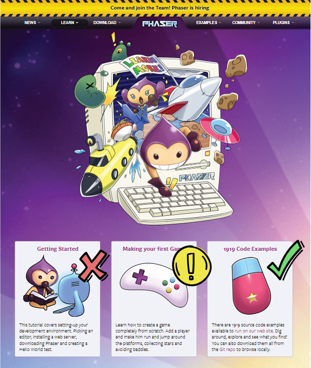  
<p>

Nessa mesma aba vocês também encontrarão o item *"Making Your First Game"*. Esse é um tutorial inicial do Phaser e nós utilizaremos ele como base para desenvolver os Projetos Individuais. No entanto, **recomendamos que você siga o tutorial proposto em [Projeto Individual](#projeto-individual-parte-1)**, pois abordaremos os **autoestudos ponderados** e existem tarefas adicionais que não constam no tutorial do phaser.

<br>

**Download do Phaser**

Visite a página de [download do Phaser](https://phaser.io/download/stable) e escolha a opção que indica JS, a apontada na imagem a seguir.  
Você deve conseguir fazer o download do arquivo "**phaser.js**". Salve esse arquivo em uma pasta do seu computador, de maneira organizada e acessível - esse é um arquivo que usaremos recorrentemente ao longo do módulo.

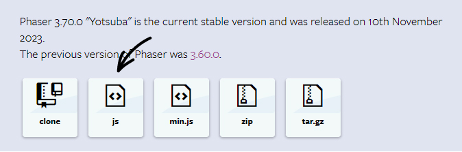  

<p> 

<br>


#### :white_medium_square: Visual Studio Code (VSCode)
> fazer instalação do *VSCode*

**O que é Visual Studio Code?**

O *Visual Studio Code* ou *VSCode* é uma IDE (*integrated development environment* ou ambiente de desenvolvimento integrado). Um dos [autoestudos](https://adalove.inteli.edu.br/) dessa semana é um vídeo que explica tudo sobre o VSCode! Não deixe de assistir.  

Podemos entender uma IDE como o VSCode como um "editor de texto" como o *word* ou *bloco de notas*, mas especialmente desenvolvido para códigos e programação, já que ele: 
- cria diferentes destaques (cores) para sintaxes, palavras-chaves, strings, números e comentários;
- oferece recursos de depuração integrados (o processo de encontrar e corrigir erros ou bugs no programa que estamos escrevendo);
- possui um terminal integrado, permitindo que os desenvolvedores executem seus códigos diretamente da IDE;
- fornece recursos avançados de autocompletar e sugestões;
- suporta uma ampla variedade de extensões (ferramentas adicionais) que habilitam diferentes linguagens de programação, integração com serviços externos, temas personalizados, entre outros recursos → usaremos a extensão 'Live Server' do VSCode;

<br>

**Instalar o VSCode**

Para fazer a instalação do VSCode, visite a [página de download](https://code.visualstudio.com/download) e opte pela versão mais apropriada para o seu computador e sistema. Faça o download e siga os passos da instalação. Quando a instalação for concluída, você deve conseguir abrir o programa e acessar uma tela como na imagem a seguir.

<br>

**Explorando o VSCode**


  

<p>

Se você preferir uma interface escura, no menu superior escolha outro tema em: ``File > Preferences > Theme > Color Theme``  

  

<p>


No menu lateral esquerdo, clique na primeira opção ``Explorer``, como na imagem a seguir. Esse é o seu *explorador de arquivos*. Muitas vezes usaremos mais de um arquivo de maneira integrada. Nessa aba temos uma visão de nossa estrutura de arquivos e podemos gerenciar e editar as posições, nomes e conteúdos dos arquivos, inclusive criando novos arquivos diretamente no VSCode.

**Crie uma pasta e abra ela no VSCode.**

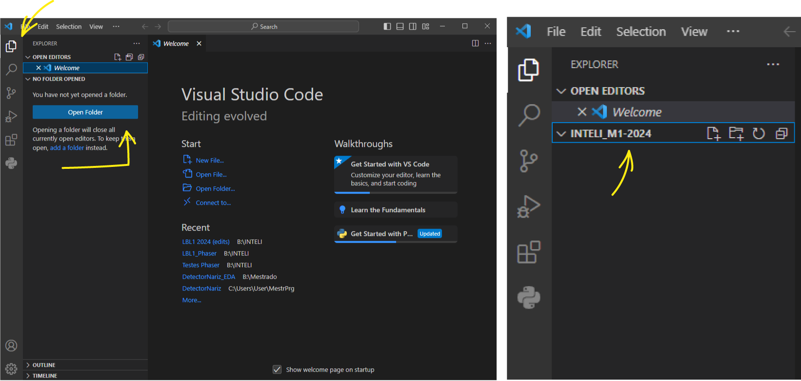  

<p> 

Ache seu arquivo "**phaser.js**" (talvez ele esteja em sua pasta Downloads!) e transfira ele para dentro dessa nova pasta que você acabou de criar. Você pode arrastar o arquivo para a aba Explorer do VSCode ou copiar e colar na pasta correta diretamente no explorador de arquivos do seu computador. Por enquanto só transferimos o arquivo ``phaser`` para a pasta, ainda não estamos usando esse framework.

<br>


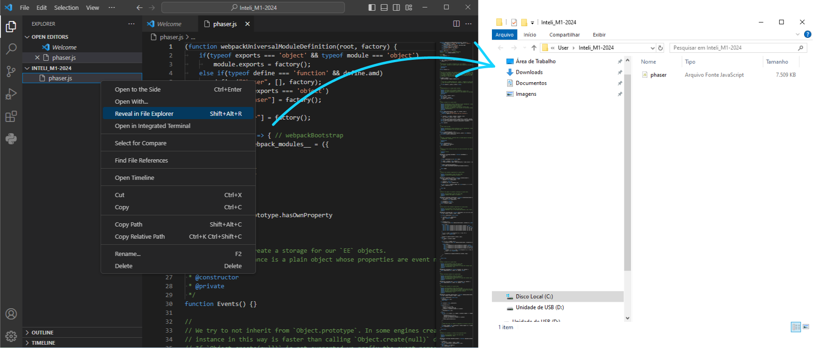  

<p>

Ao clicar com o ``botão esquerdo`` do mouse no arquivo e escolher **``"Reveal in File Explorer"``**, vocês verão o local do arquivo através do explorador de arquivos do seu computador.

Ao clicar com o ``botão direito`` do mouse no arquivo, vocês verão uma nova aba aberta, como destacado na imagem a seguir, contendo o arquivo selecionado. Esse código enorme é o *framework Phaser* com todas as estruturas e recursos para o desenvolvimento de jogos que comentamos antes. 

Na imagem também podemos ver (``linhas 39 e 43``) os destaques de cores que o VSCode faz para cada "função" de trecho no código. O *if*, por exemplo, está em azul, o que indica que o VSCode reconheceu essa estrutura condicional em JavaScript ("se alguma coisa acontecer, faça essa outra coisa"). Nas ``linhas 43 e 44`` podemos ver o texto em verde - isso acontece porque a notação *//* inicia um comentário de uma única linha. 

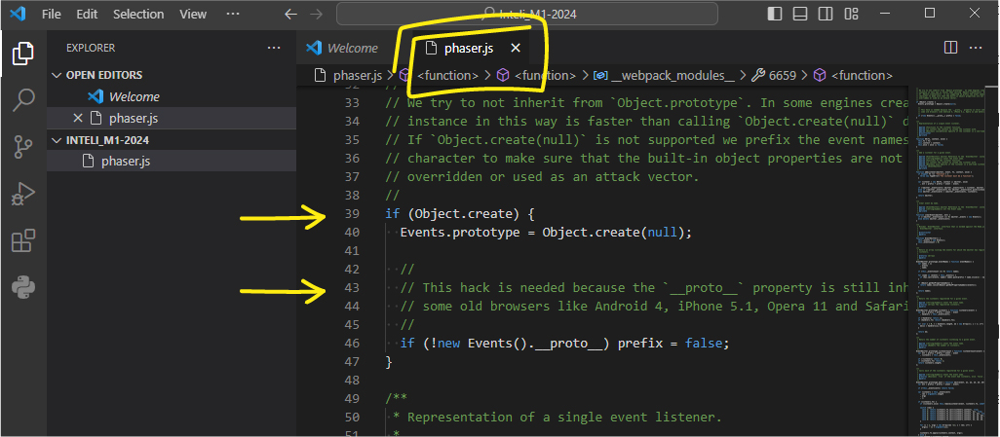  

<p>

Tente criar um novo arquivo selecionando o primeiro botão ao lado da pasta aberta no VSCode. Nomeie o arquivo como preferir, mas não esqueça de adicionar a extensão *".js"* no final - isso indica o tipo de arquivo que estamos criando e como ele deve ser interpretado pelo computador e pelo VSCode. Vamos usar esse arquivo para fazer uma pequena utilização do terminal do VSCode com JavaScript.


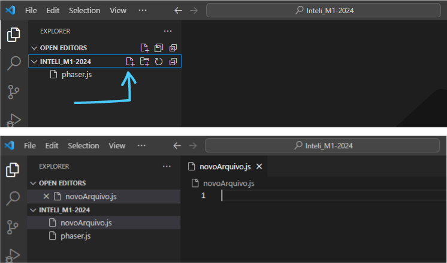  

<p>

<br>

Se em uma **calculadora** podemos teclar ``3 + 5`` e depois optar pelo botão ``=`` para obter o resultado ``8``, com **JavaScprit** podemos escrever um *programa* que ao ser executado realize essa conta e exiba o resultado encontrado (repare que são duas tarefas!). 

**Calculadora:** ``3 + 5`` → apertar botão ``=`` → resultado: ``8``  

**JavaScprit:** definir variável ``gaveta = 3 + 5;``→ comando para ``exibir gaveta;`` → resultado: ``8``  

Para realizar uma operação em JavaScript precisamos criar (ou declarar) uma variável e atribuir a ela um *valor*.  Na imagem a seguir podemos ver diversos tipos de *valores* que podem ser atribuidos a uma variável, o que inclui de um cálculo como ``3 + 5`` até uma ``'frase que pode ser bem longa'`` (existe um outro autoestudo da semana 1 com o tema "Tipos de dados em JS", não deixe de fazer!).  

  

<p>

Podemos entender uma variável como uma espécie de "gaveta". Dentro dela podemos guardar *valores*. Sempre que precisarmos poderemos acessar, usar ou "mostrar" esses valores. Os "nomes" ``gaveta_1`` ``gaveta_2`` ``gaveta_3`` são chamados de *identificadores* e são "nomes simbólicos" que passam a identificar e nomear aqueles valores determinados. Podemos usar os identificadores para realizar operações, como podemos ver na imagem a seguir.  

**Você consegue descobrir qual seria o valor de ``armario``?**

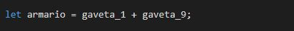  

<p>

Para visualizarmos o valor armazenado na nova variável ``armario`` precisamos escrever uma instrução para que o programa realize a ação de "mostrar valor armazenado em ``armario``". Em JavaScript podemos usar o método ``console.log()`` para imprimir mensagens, valores ou qualquer tipo de informação no *console* do ambiente em que o código está sendo executado. 

Escreva o seguinte código em seu novo arquivo no VSCode e salve: 

```
let gaveta_1 = 3;
let gaveta_9 = 3 + 5;

let armario = gaveta_1 + gaveta_9;

console.log(armario);
``` 


Por enquanto o nosso VSCode ainda não consegue "executar" o tipo de arquivo JavaScript que estamos escrevendo (não faz a conta, nem tenta mostrar o resultado). Precisaremos então da ajuda de um interpretador JavaScript (nos próximos passos instalaremos o Node.Js e o Live Server para nos ajudar a executar nossos códigos no VSCode).


<br>


**Executando JavaScript no console do navegador**

Existem dois autoestudos disponíveis na [Adalove](https://adalove.inteli.edu.br/) que abordam assuntos como "arquitetura web" e explicam a relação entre JavaScript, a internet e os navegadores. Não deixe de assistir esses vídeos! São conceitos importantes que vocês continuarão estudando no Módulo 2.

Os navegadores web contêm interpretadores JavaScript incorporados que são responsáveis por executar o código JavaScript presente nas páginas web. Por isso podemos usar o console do seu navegador favorito para visualizar o valor de ``armario``! 

**Abra uma nova aba do seu navegador** e aperte ``F12``. Procure a aba ``Console``(no Google Chrome, você pode usar, ao invés do F12, os comandos ``Ctrl + Shift + J``(no Windows) ou ``Cmd + Opt + J`` (no Mac) para acessar diretamente o console do navegador).

Como na imagem a seguir, experimente testar algumas operações. Ao digitar ``5 + 3`` o console retorna ``8``.

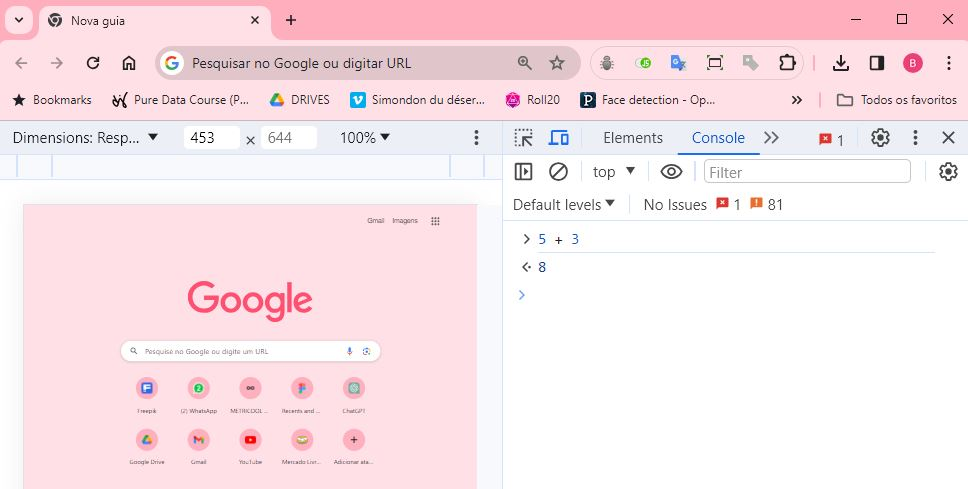

<p>

Experimente também definir uma variável usando a declaração ``let``, definindo seu identificador e atribuindo a ela um valor, como na imagem a seguir.  Quando enviamos ``let gaveta_1 = 3;`` , o console registrou que ``3`` é o valor que está sendo representado pelo nome ``gaveta_1``.


Podemos agora usar o método ``console.log()`` para acessar e imprimir no console do navegador o valor guardado em ``gaveta_1``. Veja na imagem a seguir.  

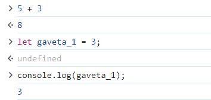

<p>

Tente usar o console do navegador para executar o código que escrevemos anteriormente, calculando e imprimindo o valor guardado em ``armario``, como na imagem a seguir. Você pode usar ``shift + enter`` para escrever diversas linhas no console do navegador.  


<p>

O console retorna o valor de ``armario``: 11. 

**Sobre o "*undefined*"**  
Repare que em alguns momentos o console vai retornar *"undefined"* ("indefinido") - e isso é normal!  

Nós definimos um *valor* para ``gaveta_1``, mas nenhuma instrução de retorno (por isso o retorno consta como indefinido ou *undefined*). Quando começarmos a escrever *funções* poderemos definir a instrução ``return`` delas. 

Veja um exemplo na imagem a seguir: uma função nomeada ``funcaoGaveta``, quando executada, retornará o *valor* representado pelo nome ``gaveta_1``. Depois de definir a função usando chaves ``{ // o comando executado pela função vai aqui dentro }``, executamos (ou "chamamos") essa função usando seu nome ``funcaoGaveta()`` (não esqueça de incluir os parêntesis!). O console do navegador *retorna* ``3``, o valor guardado em ``gaveta_1``. 

→ Vocês aprenderão mais sobre funções na *semana 2*!

<br> 

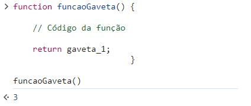
<p>

O artigo [*Running JavaScript in the Browser Console*](https://www.codecademy.com/article/running-javascript-in-the-browser-console) pode ser um bom lugar para pesquisar mais sobre JavaScript no console de Navegadores.

<p>
<br>


#### :white_medium_square:	Node.js
> instalar o Node.js

**O que é Node.js?**

Como vimos, o VSCode não consegue sozinho interpretar a linguagem JavaScript. Por isso, usaremos o Node.js para nos ajudar a executar JavaScript no terminal do VSCode. O Node.js é um ambiente de execução de código JavaScript. 

Nesse mópdulo usaremos o Node.js de uma forma bem simples, mas se você quiser saber mais sobre ele, [esse vídeo aqui](https://www.youtube.com/watch?v=vYekSMBCCiM) é um bom começo.


<br>

**Instalar o Node.js**

Para fazer a instalação do Node.js, visite a [página de download](https://nodejs.org/en/download) e opte pela versão mais apropriada para o seu computador e sistema. Faça o download e siga os passos da instalação. Quando a instalação for concluída, retorne ao arquivo que fizemos no VSCode.

No menu superior ``view`` selecione ``Terminal``.

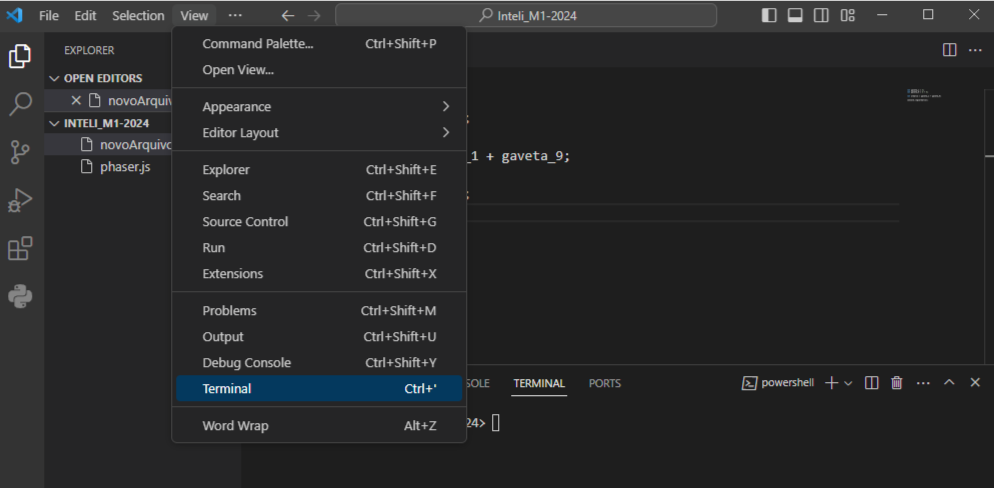
<p>

Escrevendo no terminal o comando ``node nome-do-seu-arquivo.js`` conseguiremos executar esse código JavaScript no terminal do VSCode. Depois de pressionar ``Enter``, podemos ver que o terminal imprime o valor ``11``, que corresponde à variável ``armario``. 

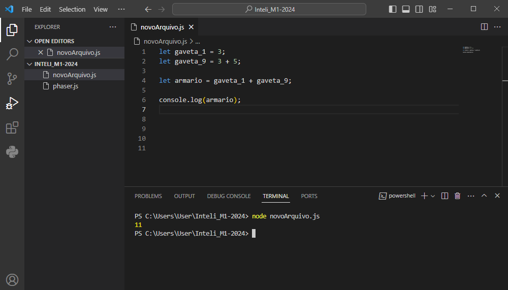
<p>

Removendo a linha ``console.log(armario)`` e usando o mesmo comando ``node nome-do-seu-arquivo.js``, como na imagem a seguir, podemos reparar que nenhum valor é impresso no terminal. Quando escrevemos no terminal e rodamos o nosso arquivo, o programa calculou o valor de gaveta_9 e de armario. Nenhum valor foi impresso porque é justamente o comando ``console.log(armario)`` que imprime o valor (armario) no terminal.

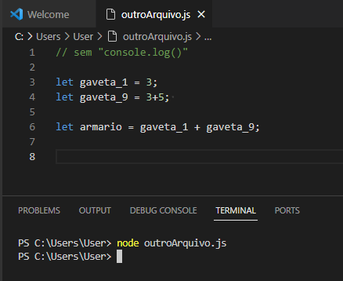


<p>
<br>

#### :white_medium_square:	Live Server
> instalar a extensão *Live Server*

Como vimos, a linguagem de programação JavaScript pode ser interpretada por navegadores web e o framework Phaser é especialmente projetado para o desenvolvimento de jogos para navegadores. No entanto, a estrutura web exige que tenhamos servidores para distribuir nossos arquivos e clientes para acessar os sites com nossos jogos (não deixe de fazer o autoestudo "Como a Web Funciona" na Adalove!).  

**O que é Live Server**

Live Server é uma extensão do VSCode que realiza a criação de um servidor local para servir projetos em tempo real, facilitando o desenvolvimento e teste de páginas web. Usaremos o Live Server para executar localmente (no computador em que estamos programando) os nossos jogos, usando o navegador para exibir a página e simulando como o jogo ficará quando for publicado na web.

**Instalando o Live Server**

No menu lateral, selecione a quinta opção ``Extensions``, procure por Live Server e faça a instalação. Usaremos essa extensão na [Parte 3: Projeto Individual](#projeto-individual-parte-1).

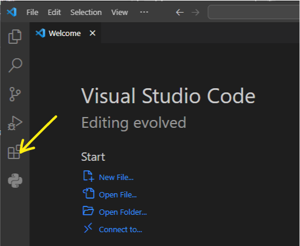
<p>

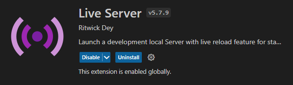
<p>

<br>


#### :white_medium_square:	GitHub e GitHub Desktop
> fazer sua conta, instalar o GitHub Desktop e Clonar o Repositório Individual 

[REVER!]
[REVER!]
[REVER!]
[REVER!]

Quais são os GitHubs usados no módulo? 
Como eles devem "fazer" os GitHubs?

- [GitHub do Módulo 1 (tutoriais)](https://github.com/InteliContent/M1)
- GitHub individual (autoestudos: projeto individual e listas)
- GitHub do Grupo (projeto parceiro)

**O que é GitHub?**

O GitHub é uma plataforma de hospedagem de código que facilita o controle de versão, colaboração e compartilhamento de projetos de software entre desenvolvedores. É aqui que vamos guardar as versões dos nossos códigos e realizar todas as entregas de autoestudos ponderados de computação e as entregas de artefatos.

Nos [autoestudos](https://adalove.inteli.edu.br/) dessa semana estão indicados dois vídeos (um em inglês e outro em português) que explicam o que é GitHub e GitHub Desktop. Não deixe de assistir esses vídeos!  

[REVER!]
[REVER!]

Acesse o [GitHub](https://github.com/) e crie sua conta. 
Acesse [GitHub Desktop](https://desktop.github.com/) e instale o programa em seu computador.


<br>


## Projeto Individual (parte 1)
**Projeto Individual: Jogo de Plataforma com Phaser**

Se você ainda não leu sobre o Projeto Individual, reveja o item **Projeto Individual: Jogo de Plataforma** em **[Atividades de Computação](#atividades-de-computação)** deste tutorial.

> :warning: **Atenção!** O Projeto Individual será baseado no [tutorial oficial do Phaser](https://phaser.io/tutorials/making-your-first-phaser-3-game), mas com algumas modificações importantes! Recomendamos que você realize o proposto aqui **antes** de visitar a página do tutorial oficial (indicaremos quando for o melhor momento)! 

> :warning: :heart: **Atenção!** Enquanto estiver realizando este exercício, lembre-se que na Adalove existem vários outros materiais que podem te ajudar a compreender melhor os conteúdos abordados aqui. Você pode optar por ler os textos e ver os vídeos indicados antes de continuar esse tutorial ou seguir com o exercício e depois realizar os outros autoestudos.


<br>


### Parte 1: Exercício do Peixe

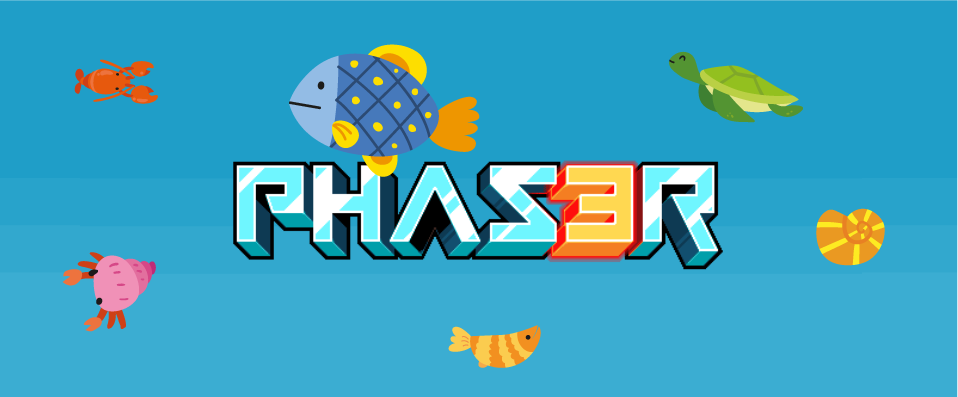

<p>
<br>

#### Organizando Arquivos

> O material que vamos usar nessa parte do tutorial está disponível no [GitHub do Módulo](https://github.com/InteliContent/M1/semana_01)

Vamos precisar organizar um pequeno conjunto de arquivos antes de começar. 

**Crie uma pasta para esse exercício (por exemplo: ``exercicio_peixe``).**

Usaremos essa pasta para guardar os arquivos necessários para esse exercício. Serão os seguintes:

- um arquivo **``index.html``** (sua página web);
- um arquivo **``peixe.js``** (seu jogo);
- uma pasta **``assets``** (pasta de imagens e outros arquivos do jogo);
- e o arquivo do framework **``phaser.js``**;

Na imagem a seguir vemos como ficará, no final do exercício, a pasta **``exercicio_peixe``** (dentro dela estão os arquivos index.html, peixe.js, phaser.js e a pasta assets). Também vemos como ficará a pasta **``assets``**: nela guardamos algumas imagens de plano de fundo do jogo (*backgrounds*), versões do logo do inteli, além de uma outra pasta chamada ``peixes``. A pasta ``peixes`` guarda algumas imagens de peixes que usaremos neste exercício.

<br>

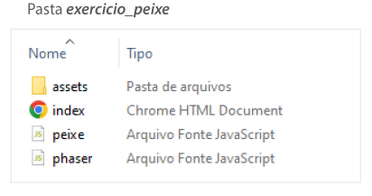
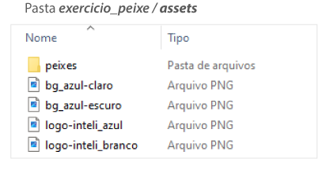

<p>

**Crie dentro da pasta ``exercicio_peixe``, as pastas ``assets`` e ``peixes``**. 
O caminho de pastas deve ficar assim: ``exercicio_peixe/assets/peixes``.

<br>
 
Com a estrutura de pastas pronta, **visite a coleção de *assets*, disponível no [GitHub do Módulo](https://github.com/InteliContent/M1/semana_01/exercicio_peixe/assets/peixes)

**Escolha um plano de fundo, um logo e um peixe para compor seu jogo**. 

Faça o download desse material e guarde nas pastas que você criou, mantendo a estrutura organizada. Salve o "plano de fundo" e o "logo" na pasta ``assets`` e o peixe escolhido na pasta ``peixes``. Salve na pasta ``exercicio_peixe`` uma cópia do arquivo ``phaser.js``.

<p>

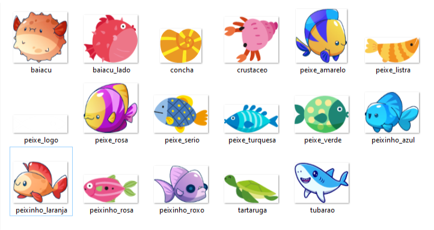

<br>

Veja na imagem a seguir como deve ficar sua estrutura de arquivos: 

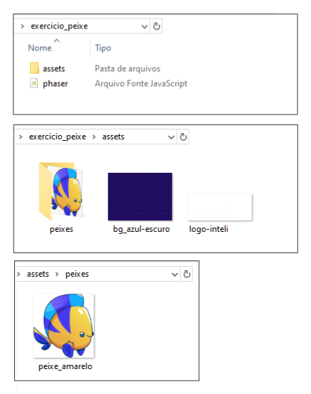

<br>

Com os arquivos organizados, podemos começar a programar!

<br>

#### Abra a pasta ``exercicio_peixe`` no VSCode

Como fizemos na parte anterior deste tutorial, use o Explorador de Arquivos do **VSCode** para abrir e visualizar os arquivos da pasta ``exercicio_peixe`` que você acabou de criar.  

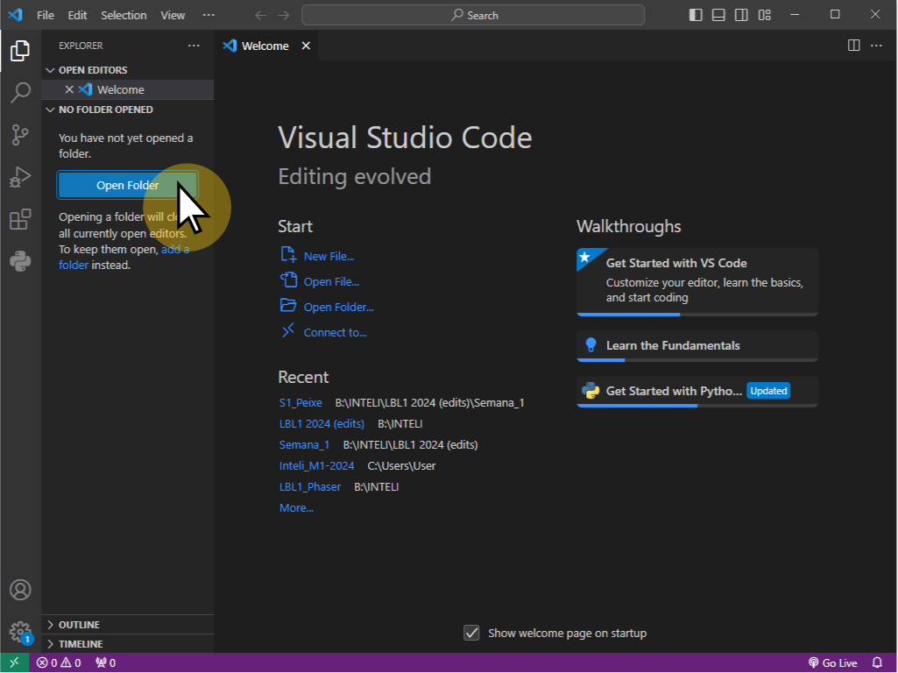

<p>
<br>

Depois de abrir a pasta, você conseguirá ver seus arquivos e pastas no Explorador de Arquivos do VSCode. Sua estrutura de arquivos deve estar parecida com a mostrada a seguir. **Usando o botão de "novo arquivo", crie os arquivos  ``index.html`` e ``peixe.js``**. Repare que, ao criar um arquivo, surge uma nova aba ``Open Editors``: aqui fica a lista de arquivos que estão abertos naquela janela do VSCode.  

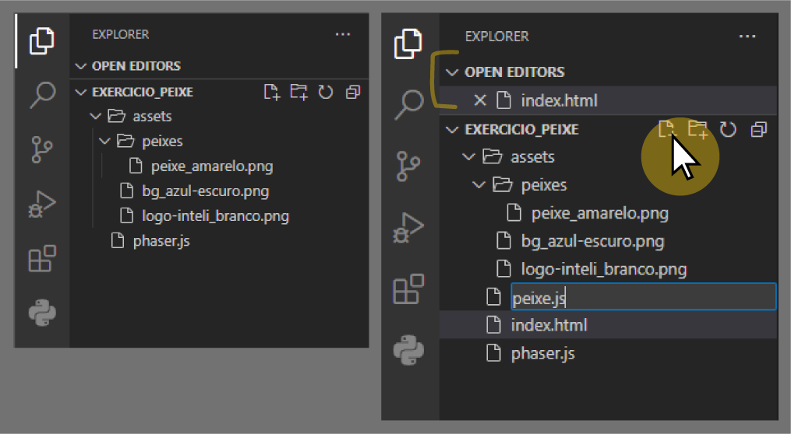

<p>
<br>

#### Sobre o arquivo ``index.html``

Diversas páginas da internet são construídas com uma estrutura HTML (Hypertext Markup Language). HTML é uma linguagem de marcação (se o assunto interessar, veja [esse artigo](https://www.codecademy.com/resources/blog/are-html-css-real-programming-languages/) sobre o debate da diferenciação entre "linguagens de marcação" e "programação"). O HTML fornece a estrutura fundamental para organizar e apresentar informações em uma página web.  

Por meio de *tags (etiquetas)* como ``<head>``, ``<body>``, ``<p>``,``<script>``, entre muitas outras, desenvolvedores marcam e identificam os diferentes elementos (estruturas, títulos, parágrafos de texto, imagens, links e outros recursos) que compõem o conteúdo de uma página.  

Em um Cartão de Aniversário podemos encontrar um título ou uma mensagem em destaque, um parágrafo de texto e uma figura, como ilustrado na imagem a seguir. Em uma versão ``<html>`` desse mesmo Cartão de Aniversário, podemos reparar que as tags ``<body>``, ``<h1>``, ``<p>`` e ```` organizam e diferenciam os "tipos" de conteúdo do cartão (corpo do cartão, título, mensagem e imagem).  

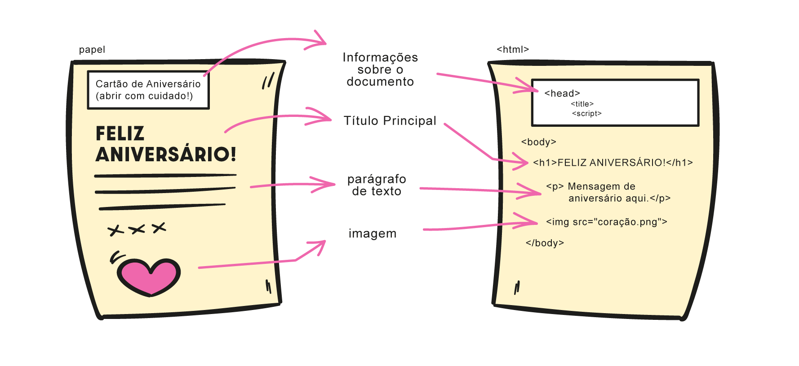

Imagine que o Cartão de Aniversário foi comprado em uma loja e veio em uma embalagem com uma etiqueta. Nessa etiqueta você encontraria informações sobre o tipo de produto, código de barras, instruções, entre outras. É mais ou menos esse o papel do cabeçalho. Ele é marcado pela tag ``<head>`` e informa o navegador de como ele deve interpretar aquele arquivo. Já no corpo do arquivo, na tag ``<body>``, inserimos o conteúdo da página (os títulos, textos, imagens).  

Usaremos a seguinte estrutura HTML para construir uma página web que abrigue nosso jogo. Como podemos ver na imagem a seguir, colocaremos o nosso jogo ``peixe.js`` em ``<body>``.


<p>

<br>

#### Editando o arquivo ``index.html``

**Copie e cole o seguinte código para seu arquivo ``index.html``.**  
**Sua tarefa aqui é completar os comentários em sua versão do arquivo.**  

Depois de completar o arquivo, salve a nova versão. Usaremos em breve.

```
<!DOCTYPE html>
<html lang="en">

    <head>
        <!-- O que essa parte faz? -->
        <meta charset="UTF-8">

        <!-- O que essa parte faz? -->
        <meta name="viewport" content="width=device-width, initial-scale=1.0">
        
        <!-- O que essa parte faz? -->
        <title>Peixinho</title>
        
        <!-- O que essa parte faz? -->
        <script src="phaser.js"></script>
    </head>


    <body>
        <!-- O que essa parte faz? -->
        <script src="peixe.js"></script>
    </body>

</html>
```

<br>

#### Editando o arquivo ``peixe.js``

Esse arquivo será o nosso jogo em si. Programaremos em JavaScript com o apoio do framework ``phaser.js``. Comecaremos nosso arquivo com uma pequena estrutura usada com **phaser**. Veja na imagem a seguir.  

Em ``config`` encontramos um conjunto de configurações básicas do nosso jogo. ``Phaser.AUTO`` indica que o navegador escolhe automaticamente o tipo de renderizador da página web, enquanto ``width`` e ``height`` indicam a largura e altura da tela do nosso jogo. Ainda em ``config``, encontramos ``scene`` que define as funções que serão executadas durante o ciclo de vida do jogo (preload, create, update).  

Depois, na ``linha 13``, vemos as ``config`` sendo usadas dentro de ``new Phaser.Game(config)``. Estamos criando uma variável ``game`` e guardando nela um "novo jogo phaser" que vai usar as configurações que definimos em ``config``. Também podemos dizer que esse comando "cria uma instância do jogo Phaser".  

No final desse código, podemos ver as funções do ciclo de vida do jogo (preload, create, update) sendo definidas.  

Usaremos ``preload()`` para carregar os recursos do nosso jogo. Os recursos carregados aqui estarão disponíveis para uso na função create().  

Em ``create()`` poderemos criar e configurar elementos do jogo, usando uma "imagem.jpg" que carregamos em ``preload()`` para criar um player em ``create()``.

Em ``update()`` definiremos a lógica de atualização em tempo real do jogo, como a detecção de colisões e o movimento de personagens. Depois de executar as duas primeiras funções, a função Esta função ``update()`` será chamada em um loop constante.

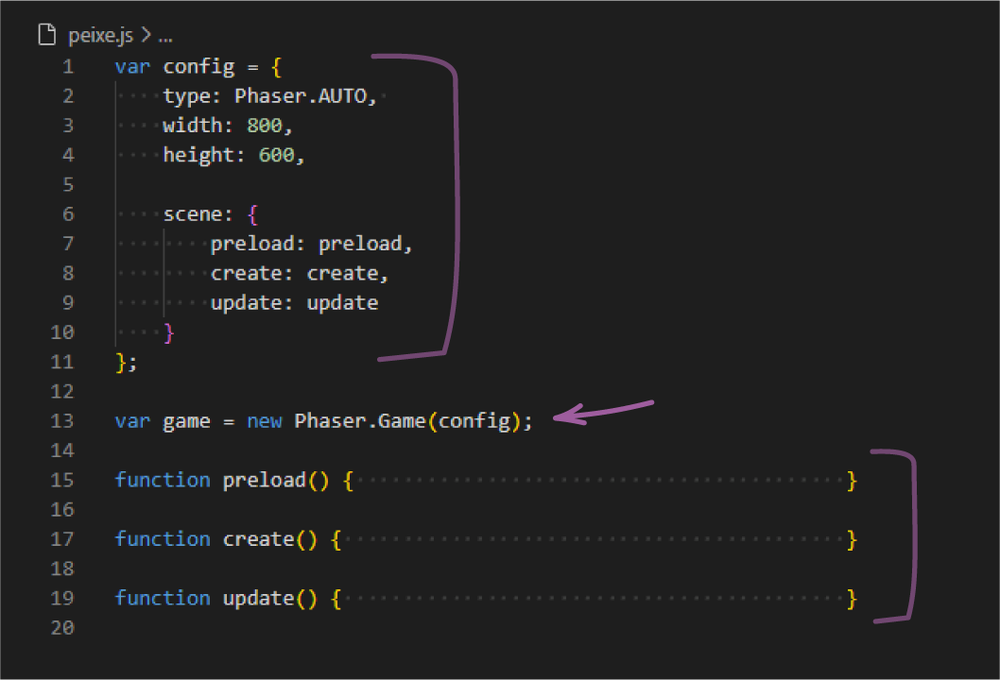

<p>
<br>

**Complete as funções ``preload()`` e ``create()``, como na imagem a seguir, para definir um plano de fundo para o seu jogo.**  

Veja o exemplo na imagem a seguir e adapte o código para usar a imagem que você já tinha escolhido. 

Na ``linha 16``, em ``preload()``, definimos ``'mar'`` como o "apelido", o identificador dessa imagem (você pode escolher o nome que preferir!). Nssa linha, ajuste o nome do arquivo.  

Na ``linha 20``, em ``create()``, usamos ``'mar'`` para adicionar essa imagem na tela do nosso jogo. Usamos ``400, 300`` para definir as coordenadas (o posicionamento) da imagem na tela do jogo (centro da largura e altura que definimos anteriormente em ``config``). 

<br>

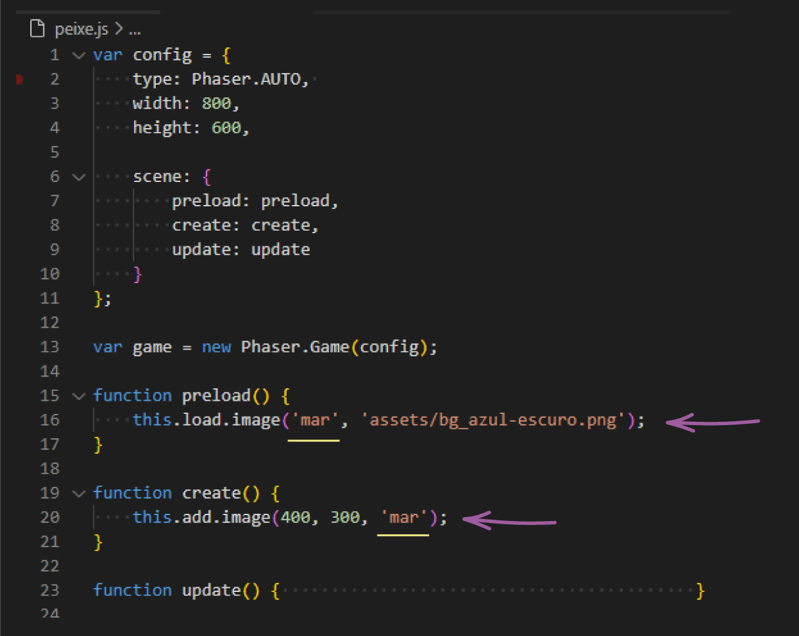

<p>
<br>

Com os dois arquivos salvos (``index.html`` e ``peixe.js``), clique com o botão direito do mouse no arquivo ``index.html`` e escolha "Abrir com Live Server", como mostra a imagem a seguir. O Live Server pode demorar alguns segundos para iniciar seu funcionamento (e podem aparecer algumas mensagens dizendo que alguma porta está ocupada). Seu computador deve exibir uma nova aba do seu navegador com a imagem de plano de fundo em uma area especifica. 

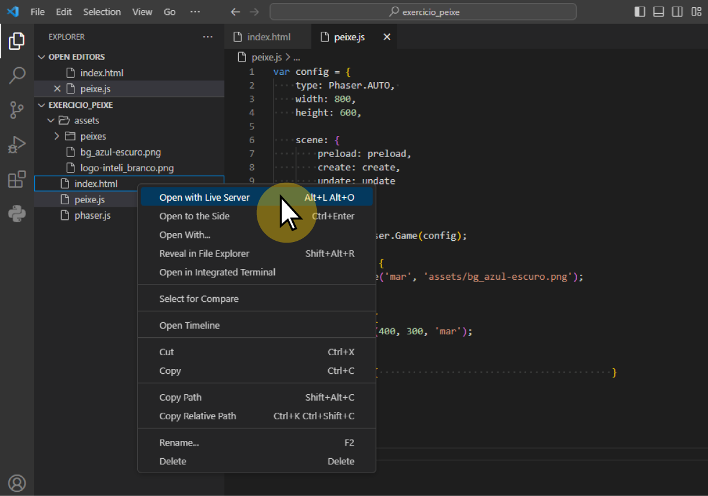

Se essa opção não estiver disponível para você, reveja a instalação do Live Server.

<p>

Repare que o texto no topo da aba está definido no arquivo ``index.html`` e que o final da URL (endereço do site) também aponta para esse arquivo. Repare também que nossa imagem não ocupa a página web inteira. Isso acontece porque estamos aplicando a imagem dentro da tela do jogo, de tamanho "(width: 800, height: 600)" como definida em ``config``. Experimente alterar esses valores e salve novamente o arquivo (a página web deve atualizar automaticamente, mas você pode apertar ``F5`` para recarregar a página se for necessário).  

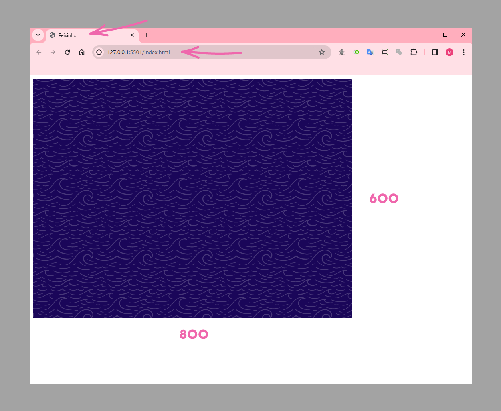  

Se você não conseguir visualizar a imagem e a página web exibir uma quadrado preto, reveja o caminho e a nomeação do arquivo de plano de fundo (.png ou .jpg) que esta tentando carregar.  

<p>
<br>

#### Voltando ao arquivo ``index.html`` (adicionando CSS)  

**Abra o arquivo ``index.html`` e adicione o trecho de código destacado na imagem a seguir.**

Usaremos a tag ``<style>`` para adicionar um trecho de CSS que nos ajudará a posicionar a tela do jogo dentro da tela do site. Esse trecho de código CSS (Cascading Style Sheets) define um estilo para o elemento ``<body>`` de uma página HTML. Definimos o modelo de layout flexível ``flex``, centralizamos horizontalmente (com ``justify-content``) e verticalmente (com ``align-items``) os elementos da página, definimos a altura do ``<body>`` como 100% da altura da janela (viewport height) e definimos a margem do nosso arquivo como 0px (cada navegador usa um tamanho de margem padrão, caso não exista essa definição no código).  

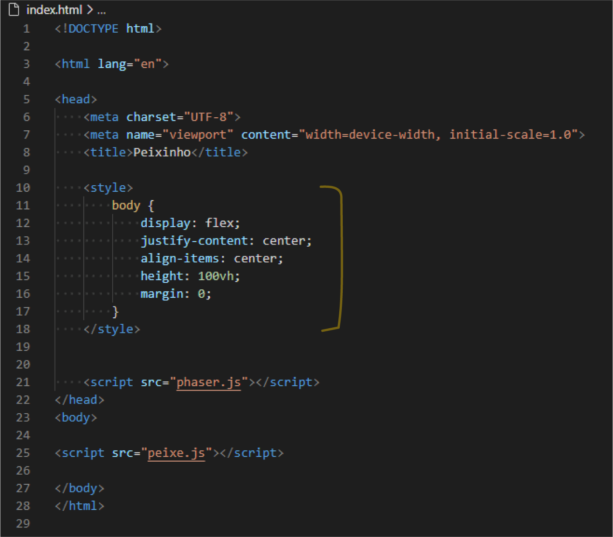  

<p>
<br>

**Copie o trecho de código a seguir e cole no local adequado** (depois de ``<title>``, dentro do arquivo ``index.html``)

```
        <style>
            body {
                display: flex;
                justify-content: center;
                align-items: center;
                height: 100vh;
                margin: 0;
            }
        </style>
```
<p>
<br>

Depois de implementar o trecho CSS, sua página web deve se comportar como na imagem a seguir, mantendo a tela do jogo sempre centralizada em relação às bordas do site.

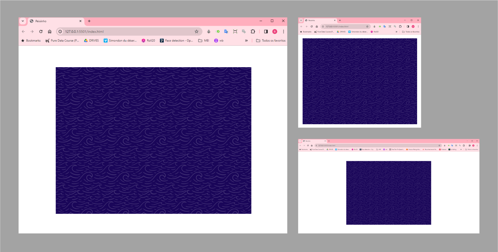  

<p> 
<br>

#### Adicionando os outros elementos em ``peixe.js``

Adicione o logotipo escolhido, primeiro carregando o recurso na ``função preload()`` e, depois, adicionando o recurso na tela na ``função create()``.  

Também adicione a imagem do peixe escolhido, primeiro carregando o recurso na ``função preload()`` e, depois, adicionando o recurso na tela na ``função create()``.  

Na imagem a seguir existem alguns trechos sublinhados em amarelo. Essas são funções adicionais que você pode usar depois de ``this.add.image()`` para editar e ajustar alguns aspectos da imagem.  

``setScale()`` realiza alterações no tamanho da imagem e ``setFlip()`` indica se a imagem deve ser espelhada horizontalmente ou verticalmente.  

Já ``setOrigin()`` determina a origem daquela imagem. O ponto de origem é o ponto em torno do qual o posicionamento, a rotação e o dimensionamento da imagem serão definidos. Por padrão, o ponto de origem é no centro da imagem ``(0.5, 0.5)``, mas podemos definir que sua origem é o canto esquerdo superior, usando ``.setOrigin(0,0)`` ou no inferior direito usando ``.setOrigin(1,1)``.  

Você também pode usar os métodos ``.setTint(cor)``, ``.setAngle(45)``, ``.setSize(w, h)``, ``.setCrop(0, 0, 100, 100)`` ou ``.setShadow (posX, poxY, #cor, blur, followTarget, update)`` para editar as imagens adicionadas na tela.  

Você pode encontrar mais informações na [documentação do Phaser](https://photonstorm.github.io/phaser3-docs/Phaser.GameObjects.Image.html).  

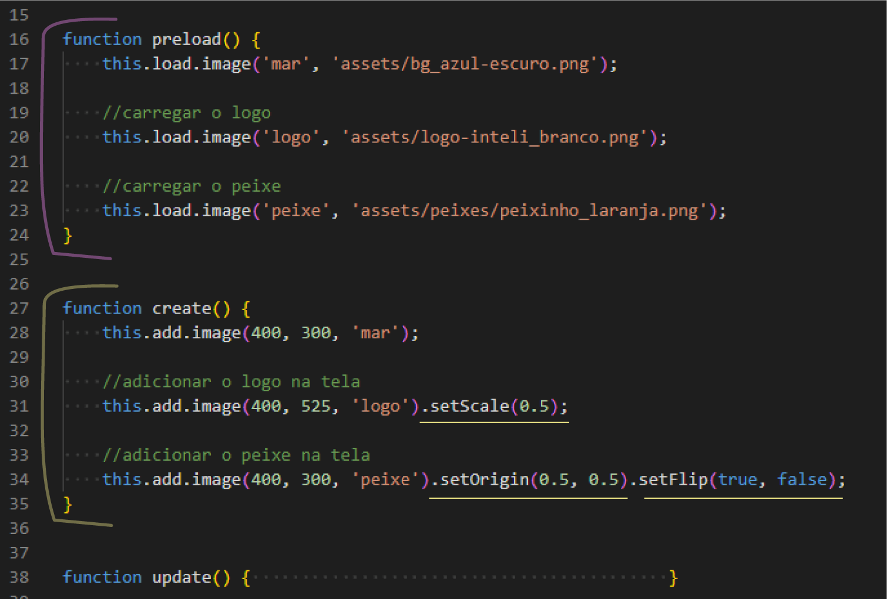  

<p>
<br>

Depois de carregar, configurar e adicionar na tela do jogo todos os elementos (fundo, logo e peixe), você deve conseguir visualizar uma página web parecida com a imagem a seguir.

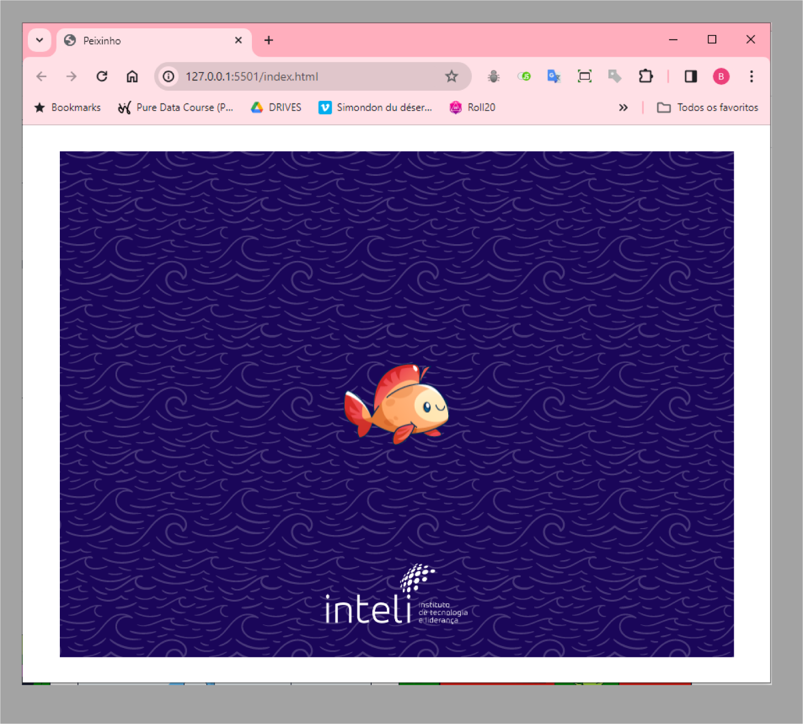  

<p>
<br>

#### Adicionando movimentos no ``peixe.js``

Para adicionar movimentos no peixe, vamos criar uma variável **``var peixinho``** (você pode escolher outro nome) antes de declarar as funções (preload, create e update, ver linha 15). Usaremos essa variável para guardar o peixe que criamos na tela com ``this.add.image`` (ver função ``create()``, linha 29). 

Com essa variável criada, poderemos aplicar métodos como o ``setFlip()`` diretamente em ``peixinho`` (ver linha 32).

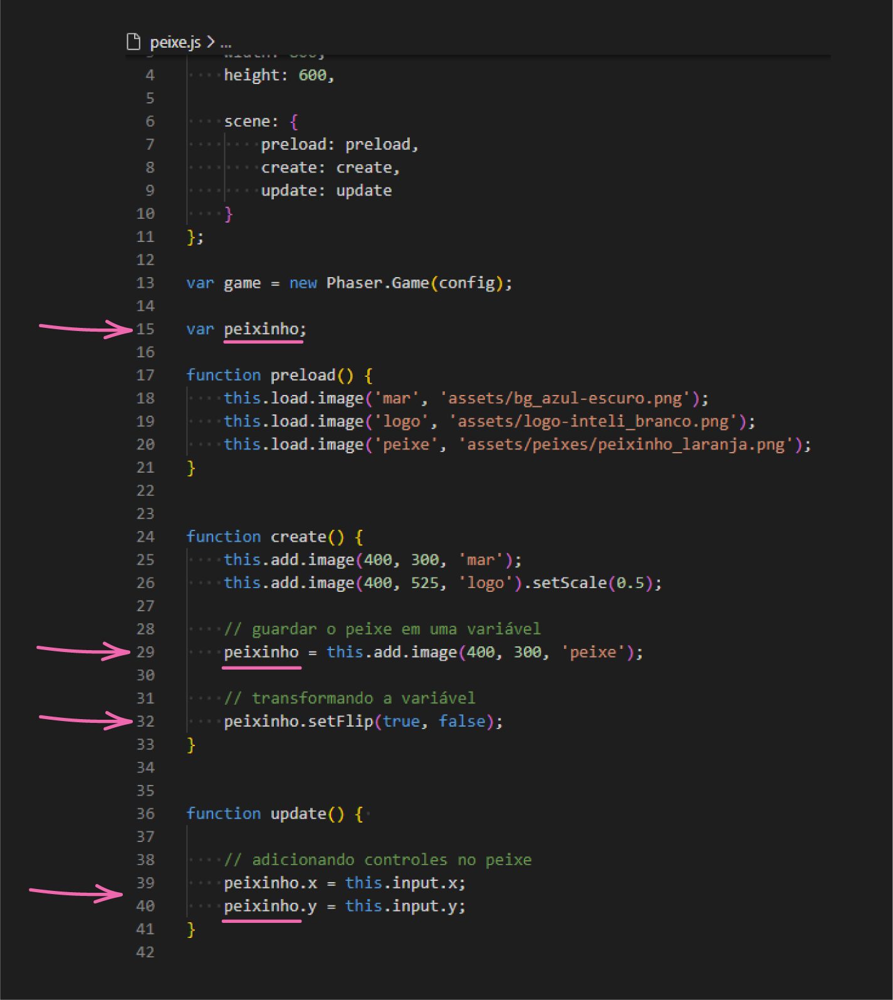  

<p>

Na ``função update()``, adicione o trecho de código das linhas 39 e 40, como indicado na imagem.  

``peixinho.x`` é a posição em x, ou horizontal, de peixinho, enquanto ``peixinho.y`` se refere à posição vertical deste objeto. Já ``this.input.x`` se refere à posição horizontal do cursor (a seta controlada pelo mouse) e ``this.input.y`` se refere à posição vertical dele.  

Na *linha 39* estamos dizendo que a ``posição x do peixinho`` deve assumir o valor da ``posição x do mouse``, e na *linha 40* repetimos essa indicação para as posições em y. Ou seja, determinamos que a posição do peixinho deve ser atualizada constantemente (função update()), assumindo os valores da posição do cursor do mouse.  

Sempre que o cursor do mouse mudar de lugar, o peixe também mudará de lugar.  

Salve os arquivos, recarregue a página ``index.html`` e verifique o funcionamento da página.  

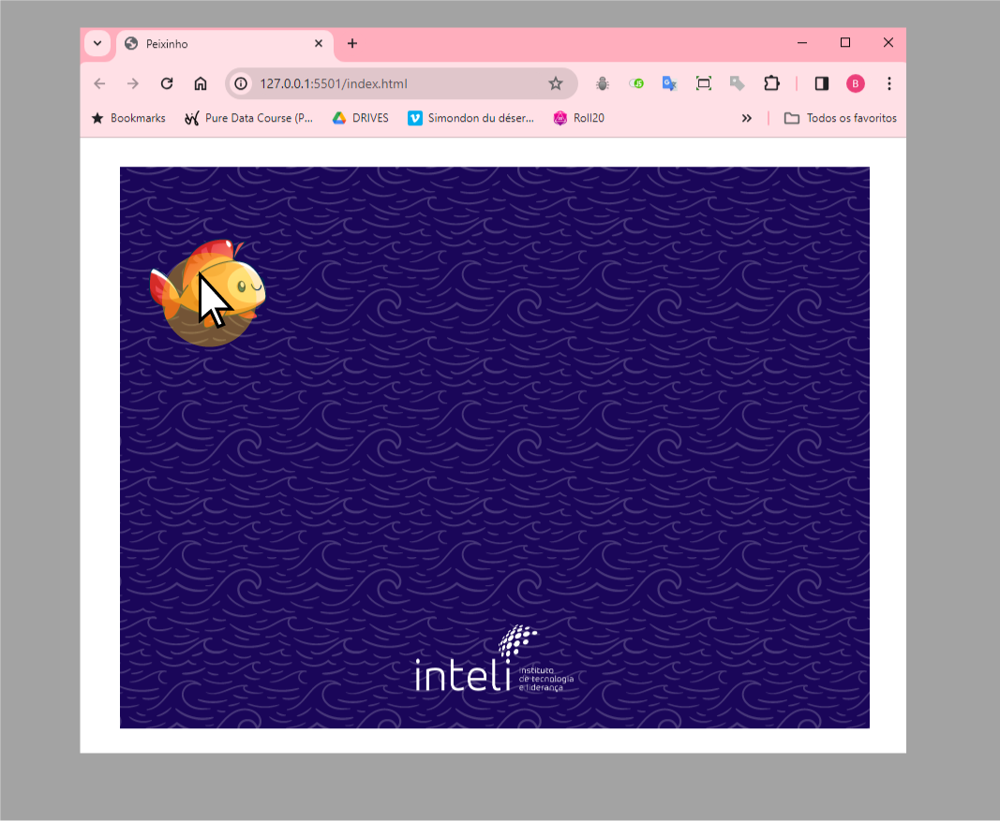  

<p>

<br>

<br>

#### TAREFAS EXTRAS

#### No arquivo ``index.html``

**1. Transforme o título do arquivo, alterando o texto que aparece na aba do navegador**
Procure a tag ``<title>`` e insira seu nome como título do arquivo.

**2. Responda a pergunta a seguir usando um ``console.log(resposta)``**

Dentro de ``<body>``, adicione uma tag ``<script> ... </script>``. Dentro dela, crie uma variável ``resposta`` para responder a pergunta indicada. Você pode usar a declaração ``var resposta = "guarde seu texto aqui"`` para guardar sua resposta dentro da variável.  

Depois, use o comando ``console.log()`` para imprimir sua mensagem no console do navegador assim que carregar a página. Não esqueça de testar!  

A pergunta que você deve responder é a seguinte: 

> Você já tinha programado antes? Se sim, conte um pouco da sua experiência. Se essa foi a sua primeira experiência com código, conte o que você achou! Conseguiu entender todas as partes do tutorial? Tudo funcionou?

#### No arquivo ``peixe.js``

**3. Adicione um novo elemento na tela**

Você pode adicionar um elemento de plano de fundo, um piso, uma frase, uma planta ou qualquer outro novo elemento na tela.

#### Quando terminar...

**4. Publique no GitHub**

Publique o resultado no seu GitHub Individual, no diretório designado para este autoestudo. 
[REVER!] Entega no Git Sites?


**5. Envie o link no Card da Adalove**

Não esqueça de enviar o link desse exercício publicado em seu GitHub Individual no card da Adalove!