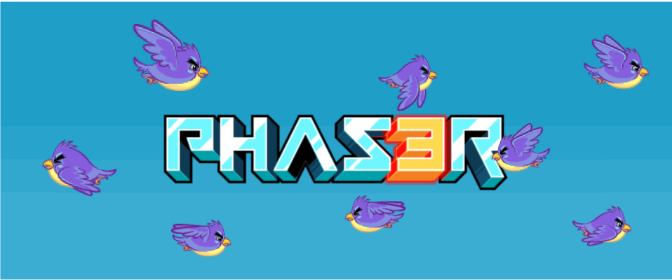
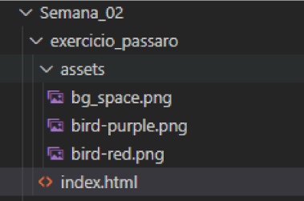
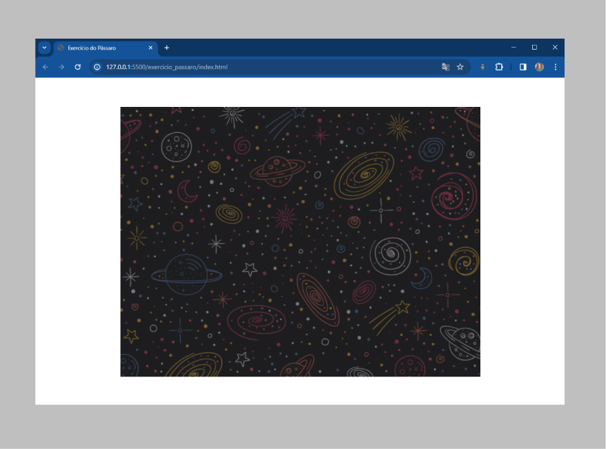
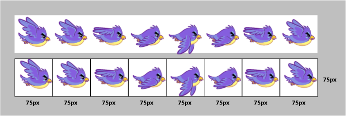
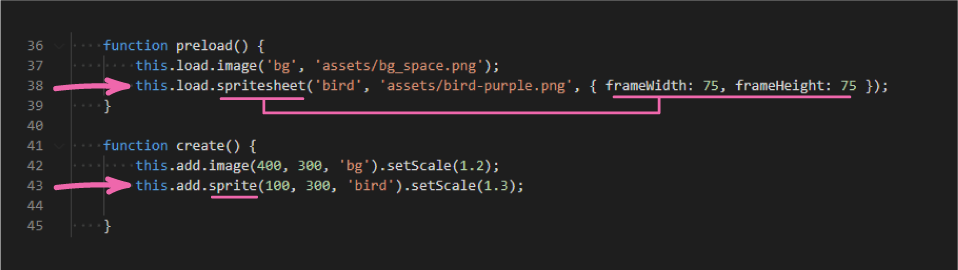
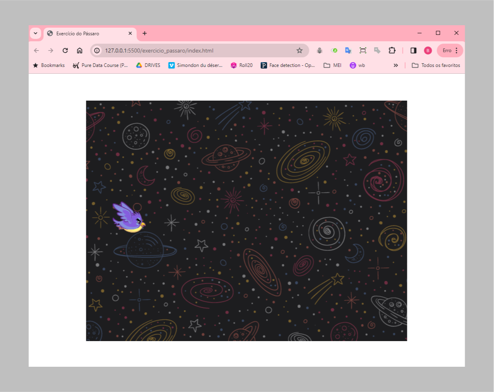
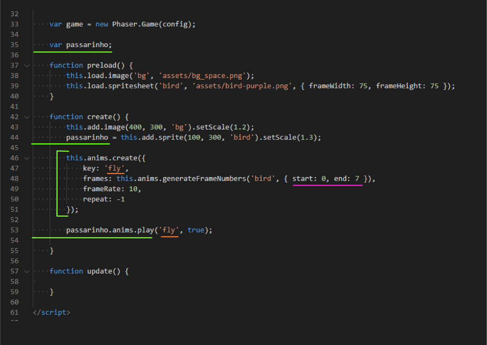
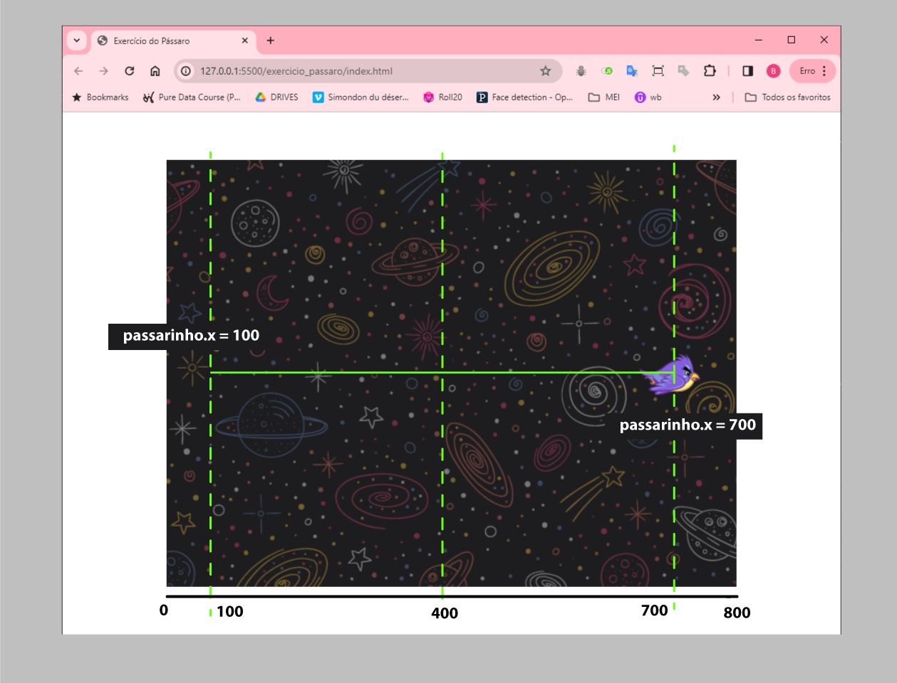
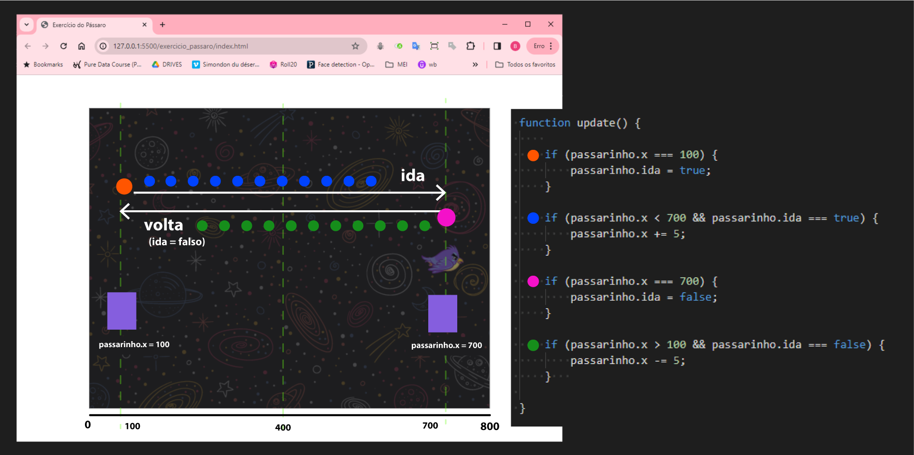
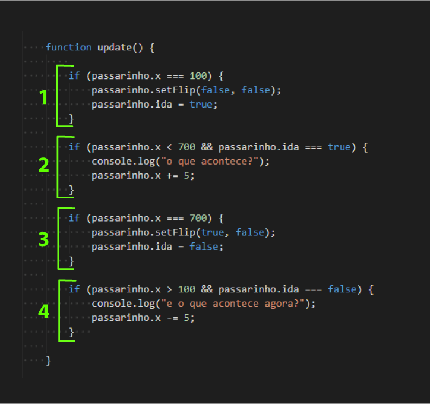

# Tutorial: Semana 2

Como fizemos no tutorial anterior, vamos construir uma página web para exibir a tela do nosso jogo. Nosso "jogo" será composto por um cenário e um pássaro voando. Esse pássaro voará em loop contínuo - e será sua tarefa construir uma sequência lógica usando JavaScript e Phaser para fazer o pássaro voar na tela.  

Você pode ver um exemplo do resultado desse exercício [nesse site aqui](https://intelicontent.github.io/M1-EX/exercicio_passaro/index.html).  

<br>

## Parte 2: Exercício do Pássaro  

  

<p>
<br>


### Organizando Arquivos

> O material que vamos usar nessa parte do tutorial está disponível no [GitHub do Módulo](https://github.com/InteliContent/M1/tree/main/Semana_02/exercicio_passaro).  

Você vai encontrar dentro de ``exercicio_passaro`` uma pasta ``assets`` com alguns arquivos de imagem e um  arquivo ``index.html`` - vamos desenvolver o código completo neste único arquivo!  



<p>
<br>

Crie essa estrutura de pastas, salve os arquivos assets e copie o código a seguir, salvando ele em um arquivo ``index.html``. Se ainda sobraram dúvidas com relação à estrutura HTML, retorne ao tutorial e aos autoestudos da semana 1.  

Repare que, dessa vez, estamos usando o arquivo ``phaser.js`` a partir de um endereço web "https://cdn.jsdelivr.net/npm/phaser@3.55.2/dist/phaser.min.js". Você consegue descobrir qual a diferença entre o arquivo ".min.js" e o arquivo ".js"? E por que aqui estamos usando um "endereço web" dentro de uma tag "script"? Faça uma pesquisa rápida, mas se sobrarem dúvidas, deixe anotado para a próxima instrução de programação!

<br>

```
// Arquivo "index.html"

<!DOCTYPE html>
<html lang="en">
<head>
    <meta charset="UTF-8">
    <meta name="viewport" content="width=device-width, initial-scale=1.0">
    <script src="https://cdn.jsdelivr.net/npm/phaser@3.55.2/dist/phaser.min.js"></script>
    <title>Exercício do Pássaro</title>
    <style>
        body {
            display: flex;
            justify-content: center;
            align-items: center;
            height: 100vh;
            margin: 0;  }
    </style>
</head>
<body>

<script>

    // vamos escrever o código (JS + Phaser) aqui dentro!

</script>

</body>
</html>
```

<br> 


### Editando o ``<script>`` dentro de ``index.html``  

**No arquivo ``index.html``, complete o trecho ``<script>`` com as configurações iniciais do arquivo Phaser, indicadas a seguir. Também adicione comentários no código, explicando pelo menos ``config``, ``preload()``, ``create()`` e ``update()``**.  


```
<script>

    var config = {
        type: Phaser.AUTO,
        width: 800,
        height: 600,

        scene: {
            preload: preload,
            create: create,
            update: update
        }
    };

    var game = new Phaser.Game(config);

    function preload() {
        this.load.image('bg', 'assets/bg_space.png');
    }

    function create() {
        this.add.image(400, 300, 'bg').setScale(1.2);
    }

    function update() { 
    }

</script>
```

<p>
<br>

No VSCode, clique com o ``botão direito`` do mouse no arquivo ``index.html`` e opte por ``open with Live Server`` / ``abrir com Live Server``. Você deve conseguir ver uma página parecida com a da imagem a seguir.  

  

<p>
<br>

### Adicionando o pássaro  

Com a estrutura html definida e o plano de fundo posicionado, podemos adicionar o pássaro à nossa cena.  

Como no universo dos desenhos animados, o movimento do nosso pássaro acontece pela troca rápida de **frames** na tela. Percorra a imagem a seguir com os olhos e tente imaginar a sequencia de movimentos do pássaro.  


<p>

Existe um tipo de arquivo de imagem muito usado para jogos chamado ``spriteSheet``. Essa imagem reune, de maneira organizada, diversos frames de movimentações de personagens ou elementos de um jogo. Podemos ver na imagem a seguir que essa faixa de spriteSheet pode ser segmentada em quadrados de 75 x 75px. Usaremos essa organização dos frames para realizar a animação do pássaro voando.  



<p>
<br>

**Adicione em seu código o carregamento da ``spritesheet`` e a adição de uma ``sprite`` para inserir o pássaro na tela do jogo**  



Enquanto nosso plano de fundo foi criado como uma ``image`` (um objeto estático, sem animação ou propriedades fisicas), usaremos o tipo ``sprite`` para adicionar o pássaro à cena - é um tipo de objeto que suporta animações, colisões, eventos e interações.  

Sua tela deve estar parecida com o que mostra a imagem a seguir. A página web exibe a tela do jogo com um plano de fundo e o pássaro.  



<p>
<br>

### Animando as asas do pássaro   

**Crie uma variável ``passarinho`` para guardar o pássaro que inserimos na tela (``linhas 35 e 44``)**.  

<p>
<br>

  

Para configurar uma animação, usaremos o comando **``this.anims.create``**. Nesse bloco, declaramos uma ``key`` para representar o nome dessa animação, indicamos quais são os ``frames`` de nossa animação (estamos usando os 8 frames presentes no arquivo spriteSheet 'bird'), um ``frameRate`` (quantidade de frames em 1 segundo) e uma indicação em ``repeat`` (``-1`` indica repetição contínua, ``0`` indica sem repetição, e um número positivo indica a quantidade de repetições).  

Depois, usaremos ``passarinho.anims.play`` (veja ``linha 53``) para iniciar a animação configurada.  

**Implemente esses trechos de código em seu arquivo, salve e veja seu pássaro batendo asas!**  

<p>
<br>

### Animando o movimento do pássaro na tela  

Agora, usando a função ``update()``, vamos implementar uma sequência lógica que execute a movimentação do pássaro na tela. Vamos usar a estrutura condicional ``if`` para propor um funcionamento para essa movimentação.  

Devemos usar o ``if`` seguindo a seguinte estrutura:  

**``if ( condição ) { tarefa }``**  

**``se ( isso acontecer ) { execute isso }``**  


A posição inicial do nosso pássaro é ``(100, 300)`` e o tamanho da nossa tela é (800, 600). Para movimentar o pássaro ao longo da tela, podemos usar a expressão ``passarinho.x`` para acessar o valor em x (horizontal) do pássaro.  

Usando o comando: **``if (passarinho.x < 700) { passarinho.x += 5 }``** veremos que sempre que a posição x for menor que 700 (cumpre a condição), será adicionado 5 ao valor da possição do pássaro (100, 105, 110, 115, ... até chegar em 700), fazendo com que ele se movimente para a direita.  


  

<p>
<br>


#### Pensando com Pseudocódigo...  

Para estruturarmos essa lógica, podemos usar o recurso do pseudocódigo: uma escrita que embaralha programação e português e produz um tipo de "rascunho de código" que não pretendemos que funcione na prática, mas que demonstra a estrutura lógica que queremos montar.  

Criaremos dois momentos: uma ``ida`` e uma ``volta``. Com as bolinhas laranja e rosa na imagem a seguir estão marcados o início da ida e da volta do pássaro. As bolinhas azuis indicam o deslocamento para direita (na ida) e as bolinhas verdes o deslocamento para esquerda (na volta).  

Para deslocar o pássaro horizontalmente na tela, podemos pensar na seguinte estrutura para esse deslocamento:  

- Se o passarinho estiver no ponto inicial (100), iniciar ``ida``;  
- Se o passarinho não tiver chegado ainda no ponto final (700), andar mais para direita;  
- Se o passarinho chegar no ponto final (700), iniciar ``volta``;  
- Se o passarinho não tiver chegado de volta ao ponto inicial, andar mais para esquerda;  


  

<p>
<br>

**Implementando o movimento em seu arquivo...**  

Na imagem a seguir destacamos o bloco ``update()`` onde consta o trecho de código, em 4 blocos, que implementa a animação de "ida" e "volta" do passarinho. No trecho, foi usado o comando ``passarinho.setFlip(horizontal,vertical)`` para espelhar a imagem, ajustando o passarinho para a direção que ele está se deslocando.  

**Implemente esse trecho no seu código, adicionando um comentário explicativo para cada um dos 4 blocos destacados na imagem.**  

Complete o ``console.log`` e use esse recurso no console do navegador para te ajudar a avaliar se seu entendimento dessa estrutura está correto.  

  

<p>
<br>

Ao final dessa implementação, o passarinho deve estar continuamente se deslocando entre as pontas do cenário. Agora, com os conhecimentos adquiridos, realize as tarefas a seguir desse tutorial.  

<p>
<br>

### Tarefas Adicionais:

**1. Organize e comente seu código!**  
Dedique um tempo para organizar espaçamentos e identações. Adicione comentários explicativos ao longo do código - aqui, quanto mais detalhado melhor! Isso garante que você tenha entendido todas as partes da estrutura. O que descobrir de dúvidas, deixe anotado em seu arquivo.  

**2. Implemente o movimento de ``passarinho.y``**  
Agora que elaboramos uma lógica de movimento para o passarinho no eixo x da tela do nosso jogo, crie uma lógica que faça o passarinho também se movimentar no eixo y. *Você pode modificar a lógica do eixo x, se preferir*. O passarinho deve se movimentar em um loop contínuo.  

**3. Publique no GitHub Individual e envie o link na Adalove**  
Publique o resultado do exercício em seu GitHub Individual, de maneira organizada. Envie o link do projeto no card da Adalove.


#### Sobre a avaliação  

Este exercício será avaliado da seguinte maneira:  

- Realização do "Exercício do Pássaro", de acordo com as instruções do tutorial: até 3 pontos  
- Implementação do movimento do passarinho no eixo vertical e produção de loop animado: até 2 pontos  
- Código comentado, explicado e organizado: até 3 pontos  
- Publicação no GitHub, em conta individual e repositório apropriado: até 1 ponto  
- Desafio! Tente usar uma estrutura de repetição (for/while) em seu código: até 1 ponto  