# Tutorial: Semana 3  

Como nos exercícios anteriores, vamos construir uma página web usando html e css para exibir a tela do nosso jogo. Ele será composto por uma tela, um plano de fundo, uma plataforma, um alienígena e algumas moedas. Faremos uma espaçonave voar e coletar moedas seguindo algumas regras de física e estruturando detecção de colisões.  

Você pode ver um exemplo do resultado desse exercício [nesse site aqui](https://intelicontent.github.io/M1-EX/exercicio_alien/index.html).  


## Parte 3: Exercício do Alienígena


<p>
<br> 

Para iniciar o **Exercício do Alienígena**, construiremos uma página html com uma imagem do fundo usando a ``estrutura html``, JavaScript e as funções do ``Phaser`` que vimos nos últimos exercícios. Utilize a estrutura disponibilizada a seguir, completando os comentários do código em seu arquivo.  

Como podemos ver na imagem e no código a seguir, criaremos duas variáveis para guardar os valores da altura e largura da tela do jogo que está sendo criado. Isso possibilita utilizar a própria variável para indicar um tamanho ou uma posição de algum elemento do jogo (ver ``função create()``).  


<p>
<br> 

**Copie e utilize a seguinte estrutura para iniciar seu jogo. Não esqueça de completar os comentários do código.**

```
<!DOCTYPE html>
<html lang="en">
<head>
    <meta charset="UTF-8">
    <meta name="viewport" content="width=device-width, initial-scale=1.0">
    <title>Exercício do Alien</title>
    <script src="https://cdn.jsdelivr.net/npm/phaser@3.55.2/dist/phaser.min.js"></script>
    <style> body { display: flex; justify-content: center; align-items: center; height: 100vh; margin: 0; } </style>
</head>

<body>
    <script>
        // o que acontece aqui?
        const larguraJogo = 700;
        const alturaJogo = 850;

        // o que essa parte faz?
        const config = {
            type: Phaser.AUTO,
            width: larguraJogo,
            height: alturaJogo,

            scene: {
                preload: preload,
                create: create,
                update: update
            }
        };

        // o que acontece aqui?
        const game = new Phaser.Game(config);

        function preload() {
            this.load.image('background', 'assets/bg.png');
        }

        function create() {
            // o que acontece aqui?
            this.add.image(larguraJogo/2, alturaJogo/2, 'background');
        }

        function update() {
        }
    </script>
</body>
</html>
```

<p>  
<br>  

### Adicionando o Alienígena  

Antes da ``função preload()``, crie uma ``variável alien`` para guardar a personagem do jogo. Carregue a imagem que usaremos para o alien em ``preload()``, e crie o alienígena do nosso jogo dentro de ``create()``. Use a variável criada para alocar o alienígena. Usaremos a expressão **``this.physics.add.sprite(posX, posY, 'id img')``** para adicionar uma *sprite* que se afeta pela física do jogo.  

**Complete o código, como indicado na imagem.**  

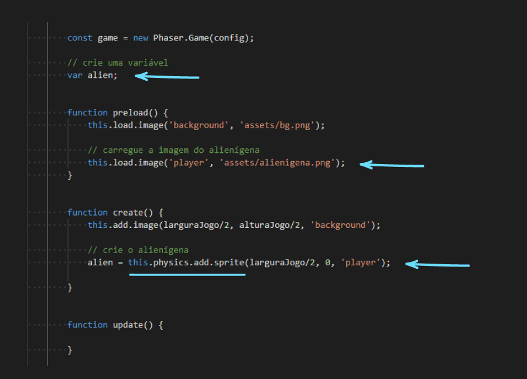

<p>  
<br>  

Se você tentou testar seu código, verá que tudo parou de funcionar. Isso acontece porque ainda não ativamos a física **``.physics``** do jogo. Dentro das configurações ``config``, precisamos ativar a física usando ``physics`` e determinando, por exemplo, que a gravidade do nosso jogo será de 300 para o eixo Y. **Complete o código para ativar a física do jogo, como indicado na imagem a seguir.**  
 
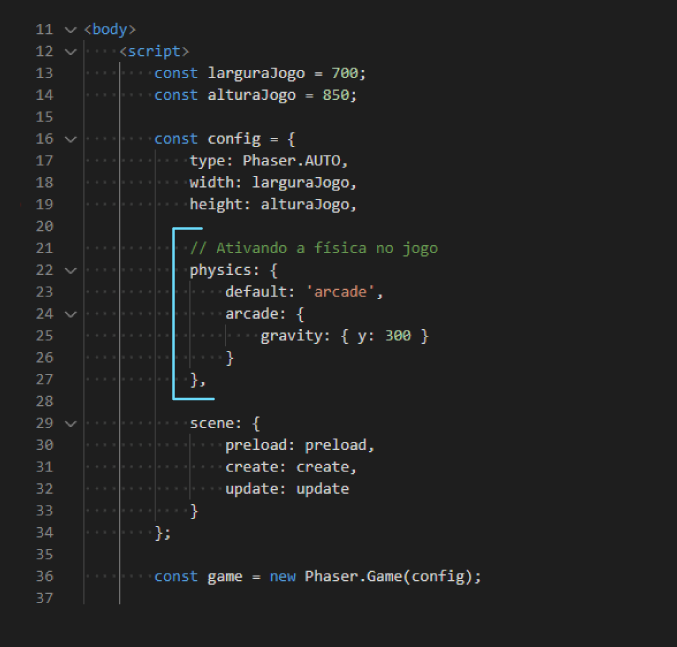  

<p>  
<br>

Depois de completar o código e abrir seu arquivo usando o ``Live Server``, você verá seu alienígena surgindo na tela e tendo sua nave afetada pela física, caindo aos poucos. No entanto, o personagem perde altura até o final da tela, e desaparece. O próximo passo será ativar "barreiras" físicas para as bordas da tela, determinando um limite espacial para movimentação do persongem.  

<p>  
<br>

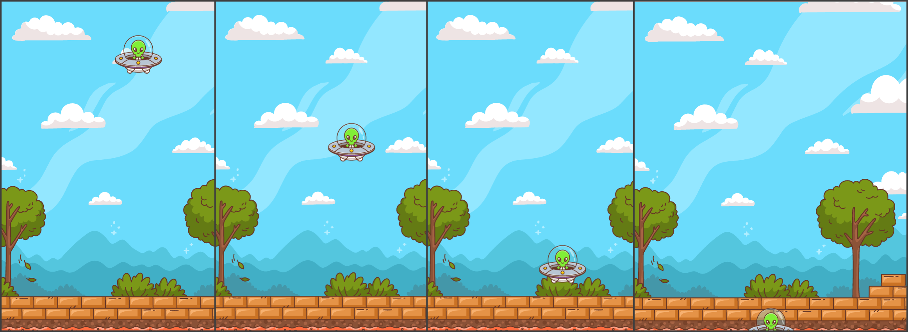
<p>  
<br>

**Complete o código, ativando os limites físicos da tela**  

Use ``.setCollideWorldBounds()`` e indique ``true`` para ativar os "limites físicos" das bordas da tela do jogo, impedindo que o personagem ultrapasse essa barreira. Complete o código e teste novamente seu jogo.  


<p>  
<br>  

### Vendo os limites: ative o modo debug

Dentro das configurações do jogo, indique ``debug: true`` para visualisar as informações de depuração (debug) relacionadas à física do jogo. Ativando esse modo você verá uma borda em seu alienígena e uma linha que se estica para baixo, conforme o personagem cai.  


<p>  

Com o debug ativado, a área desenhada pelo quadrado na tela indica a região que está sendo considerada como corpo físico do personagem. É a partir dessa área que serão determinadas as posições, os deslocamentos, as sobreposições e colisões do jogo. Você pode acessar e editar essa região através de ``.body``, por exemplo usando ``alien.body.setSize(20, 40, true)`` para editar a largura ``(20)``, a altura ``(40)`` e centralizar ``(true)`` a nova região do "corpo" do nosso alienígena. A linha desenhada indica a aceleração do personagem (nesse caso, é afetado pela gravidade e se movimenta para baixo).  


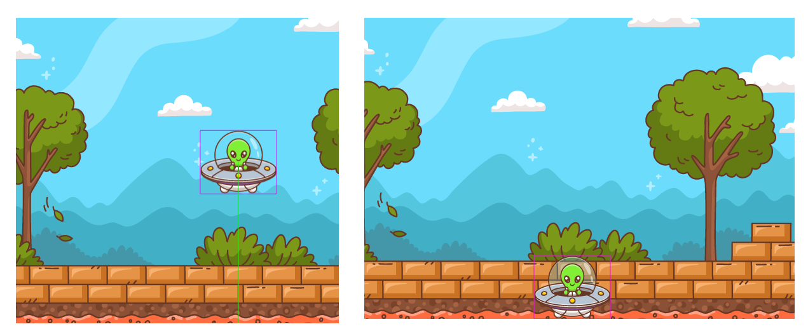

<p>  
<br>  

### Controles e movimentos do alienígena  

Usaremos o comando **``this.input.keyboard.createCursorKeys()``** para acessar as setas do teclado (direita, esquerda, baixo e cima). Crie uma variável e atribua a ela as propriedades dessas teclas, como na imagem a seguir.  

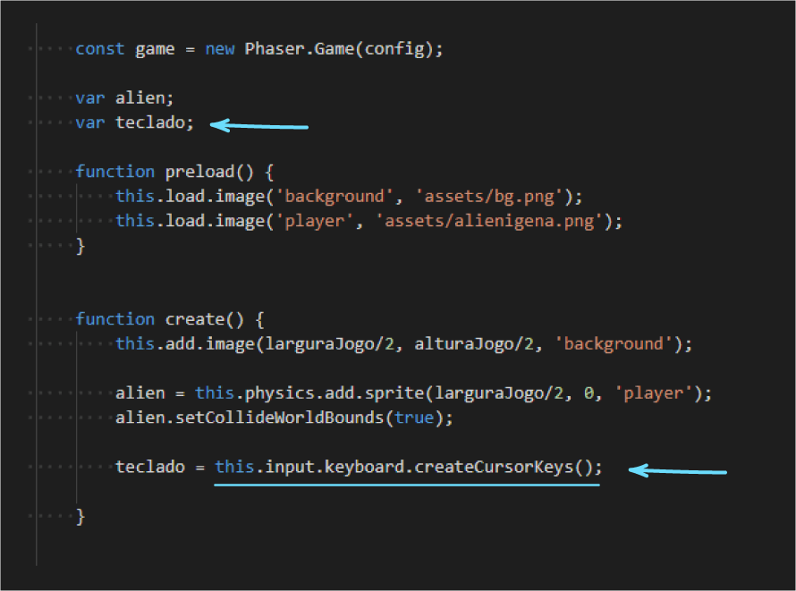  

<p>  
<br>  

Agora podemos usar, dentro da **``função update()``**, os métodos **``.left .right .up .down``** para acessar as setas do teclado e o método **``.isDown``** para verificar se a tecla foi pressionada ("se esta abaixada").  

Usando uma estrutura condicional, indicaremos no código o que deve acontecer quando cada uma das setas for apertada. Por exemplo, **``se (tecla direita pressionada) {alien se desloca para direita}``**. Veja na imagem seguinte a estrutura proposta para o movimento do alien. **Complete seu código, ativando os controles do personagem.**  

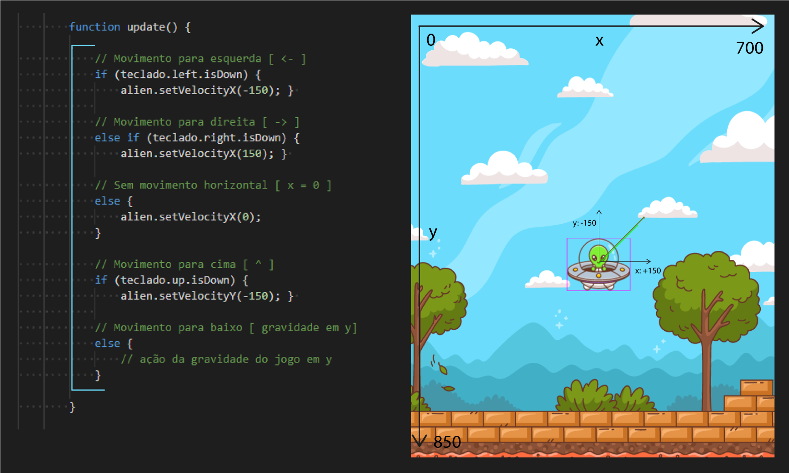

<p>  
<br>  


### Implementando Efeito Turbo  

Para indicar também visualmente que o alienígena está se deslocando para cima, podemos ativar um "efeito" no personagem. Faremos isso adicionando uma imagem de fogo (que indicará um "turbo") na nave toda vez que o personagem se deslocar para cima.  

Comece criando uma variável ``var fogo``, carregue a imagem correspondente em ``preload()`` e adicione uma sprite em ``create()``. Usaremos o método **``.setVisible``** para controlar a visibilidade desse efeito turbo. Por enquanto, usamos ``false`` para deixar a imagem desativada.  

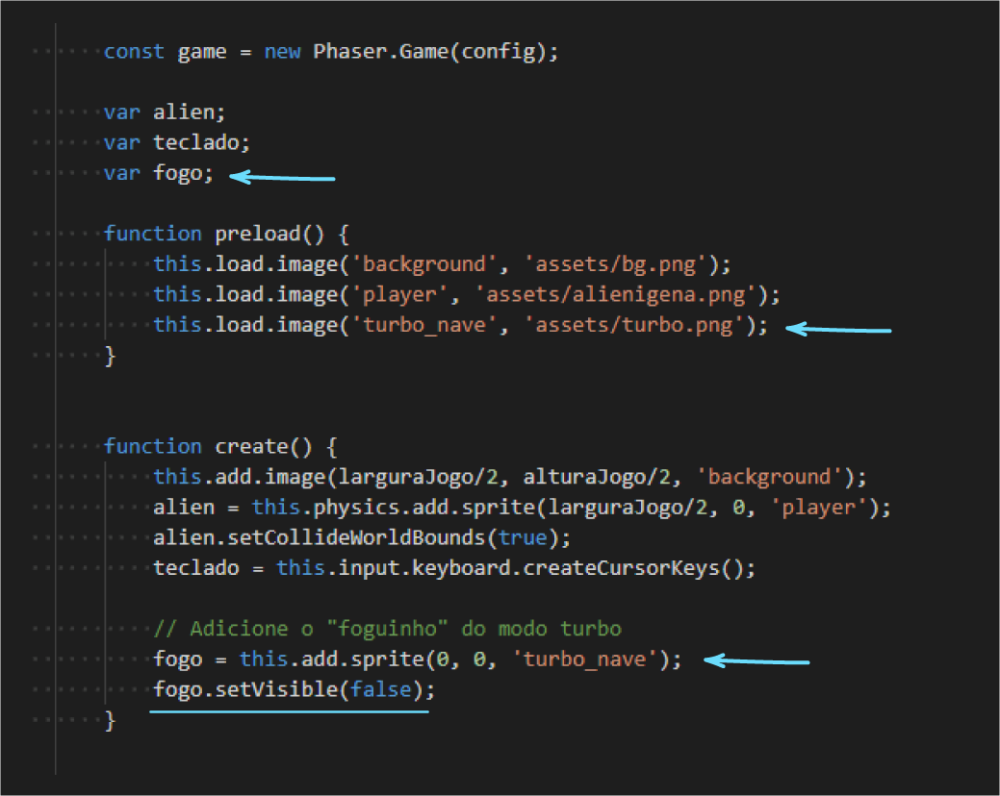

<p>  
<br>  

Depois do final de ``update() { logica de movimento aqui }``, criaremos as duas funções ``ativarTurbo()`` e ``semTurbo()`` para controlar a visibilidade do efeito, ativando ``.setVisibile(true)`` e desativando ``.setVisibile(false)`` a imagem. Veja no final da imagem a seguir como estruturar essas duas funções.  


**``Em update()``**, adicionaremos as "chamadas" dessas funções (os momentos em que aqueles comandos determinados dentro das funções devem acontecer). Adicionaremos os comandos ``ativarTurbo()`` e ``semTurbo()`` nos locais indicados na imagem para "chamar"/executar as funções que ativam e desativam a visibilidade da imagem do fogo.  

Também **adicionaremos a linha ``fogo.setPosition(alien.x, alien.y + alien.height/2)``** para atualizar a posição de ``fogo`` em relação ao ``alien``. Aqui usamos ``"alien.y + alien.height/2"`` para determinar que o fogo se posicione no mesmo y de alien (ponto central), somando metade da altura de alien para alocar o fogo na metade inferior da altura de alien, mas você pode optar pela posição relativa que preferir!  


<p>  
<br>  

:warning: Repare que o **``fogo``** está se sobrepondo ao **``alien``**. Isso acontece por conta da ordem de criação de cada objeto na tela do jogo, dentro da **``função create()``**. Se você deslocar o trecho de código que cria ``fogo`` na tela para antes da declaração de ``alien``, como indicado na imagem, verá que o Efeito Turbo agora acontece "atrás" da imagem do alien. Quando for criar seus elementos na tela do jogo, lembre-se desse funcionamento em "camadas".  

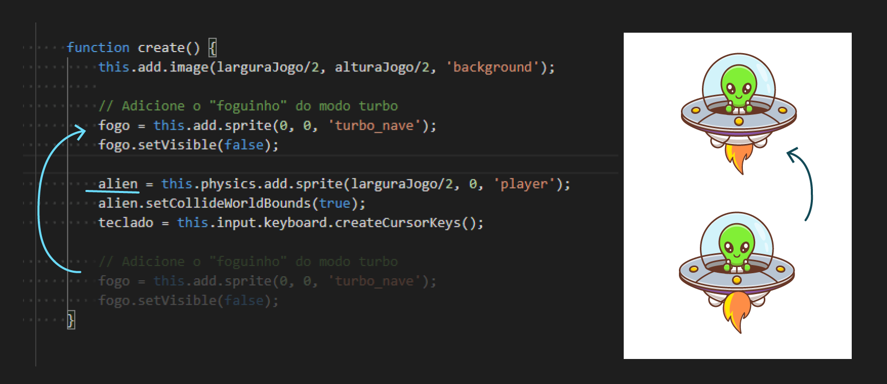

<p>  
<br>  


### Adicionando Plataforma  

Crie uma variável ``var plataforma`` e carregue a imagem que pretende utilizar para a plataforma em ``preload()``, como fizemos com os outros objetos da cena até agora.  

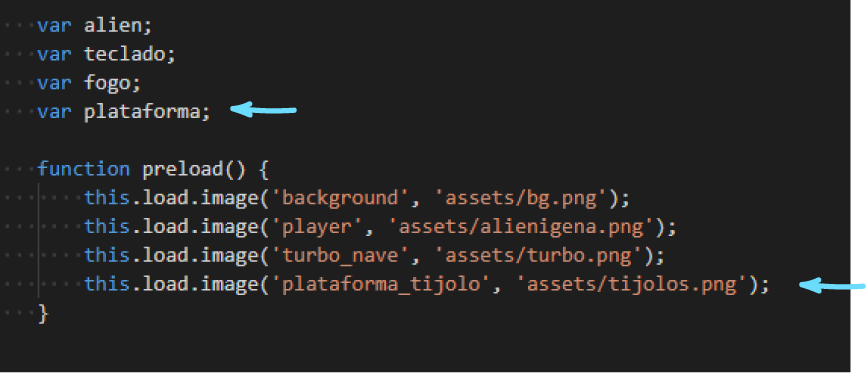  

<p>  
<br>  

Em ``create()``, use o comando ``this.physics.add.staticImage()`` para criar a plataforma na tela. Complete seu código como indicado na imagem a seguir. Você deve perceber que a plataforma foi criada, mas que o alienígena consegue atravessá-la. Resolveremos esse problema declarando uma colisão.  

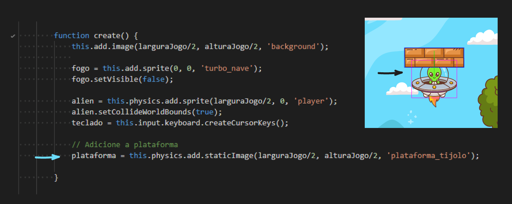  

<p>  
<br>  

Para estabelecer uma colisão, usaremos o comando ``this.physics.add.collider(obj1, obj2)``. Esse comando, assim como o ``.setCollideWorldBounds(true)`` que usamos no início deste tutorial, cria "barreiras físicas" entre os objetos indicados dentro do parêntesis. Indicando ``(alien, plataforma)``, declaramos que essa colisão entre plataforma e alien deve acontecer. O resultado é que o alienígena não conseguirá mais "atravessar" a plataforma, conseguindo agora "pousar" nela.  

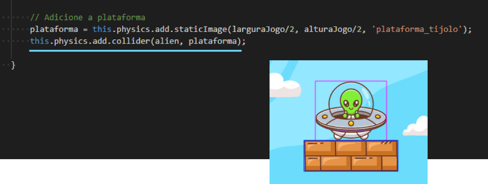  

<p>  
<br>  


### Adicionando moedas  

Agora vamos adicionar uma moeda na tela do jogo. O alienígena deverá voar até a moeda para marcar um "ponto" em nosso jogo. Como fizemos com os outros objetos da tela do jogo, carregue sua imagem em ``preload()`` e crie o objeto em ``create()``.  

Adicionaremos a moeda como uma sprite usando ``this.physics.add.sprite(x, y, 'id img')``;  

Ativaremos as "barreiras" (bounds) das bordas da tela para o objeto moeda usando ``moeda.setCollideWorldBounds(true)``;  

Ativaremos o "bounce" (um movimento de "quicar") usando o comando ``setBounce``. Essa função aceita valores entre 0 e 1, representando a quantidade de energia mantida após uma colisão.  

Ativaremos a colisão entre a moeda e a plataforma com ``this.physics.add.collider(moeda, plataforma)``, fazendo com que a moeda também colida com a plataforma;  

**Complete seu código, conforme a imagem a seguir**. 

Você deverá ver, além do plano de fundo, alienígena e plataforma, uma moeda que pula na tela.  
  
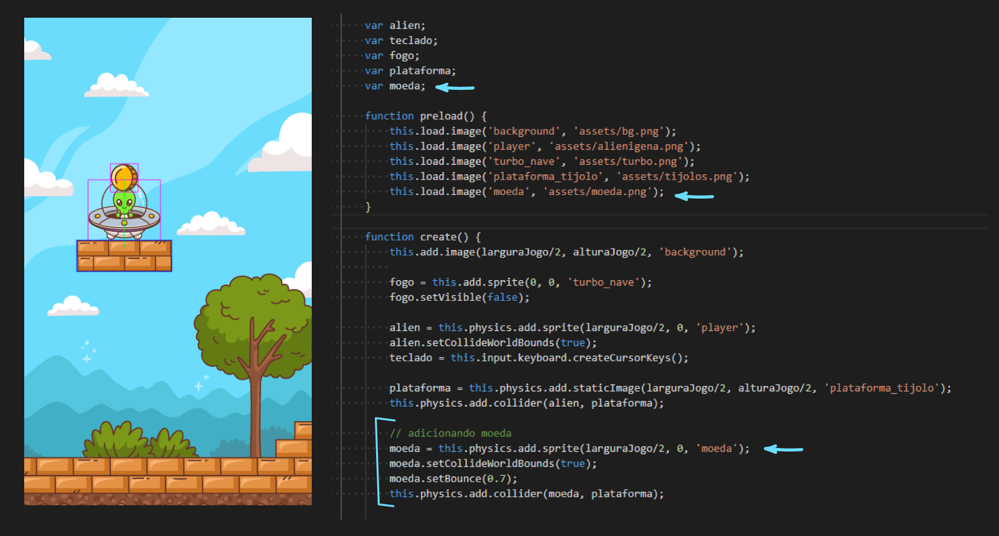

<p>  
<br>  

### Adicionando placar e pontuação  
  
Para adicionar um placar ao nosso jogo, crie uma variável ``var placar`` e uma variável ``var pontuacao = 0``, inicializando a pontuação com o valor "0".  

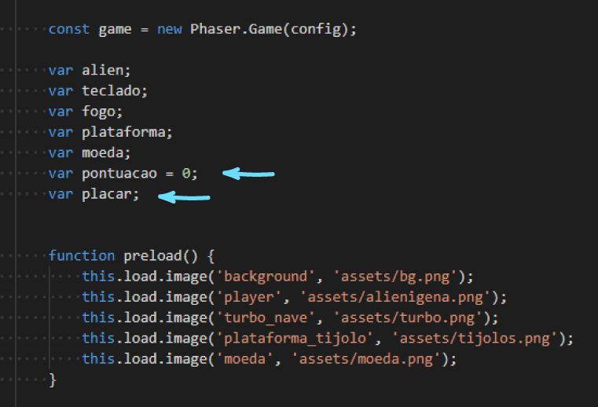  

<p>  
<br>  

Na ``function create()``, criaremos um placar usando o comando ``this.add.text(posX, posY, 'texto', {aparência})`` para adicionar um texto na tela. **Adicione em seu código o seguinte comando:**

```
// adicionando placar 
placar = this.add.text(50, 50, 'Moedas:' + pontuacao, {fontSize:'45px', fill:'#495613'});
```

Para adicionar um texto devemos indicar a ``posição (x, y)`` em que o texto deve ser adicionado, seu ``conteúdo ('moedas:' + pontuacao)`` e adicionar informações sobre sua aparência, por exemplo o ``tamanho da fonte com 'fontSize'`` e a ``cor do texto com 'fill'``.  

Atenção para a indicação ``'Moedas:' + pontuacao``. Enquanto **``'Moedas:'``** está entre 'aspas simples' (indicando um texto), a palavra **``pontuacao``** aparece sem aspas (indicando uma variável). Com a frase ``'Moedas:' + pontuacao`` pedimos que seja formada uma nova "frase" somando o texto 'Moedas:' com o valor guardado na variável "pontuacao".  

Agora adicionaremos um trecho que soma um ponto no placar toda vez que o alienígena conseguir "pegar" uma moeda. Veja nas duas imagens seguintes o trecho de código que indica "quando o alien encostar na moeda..."  

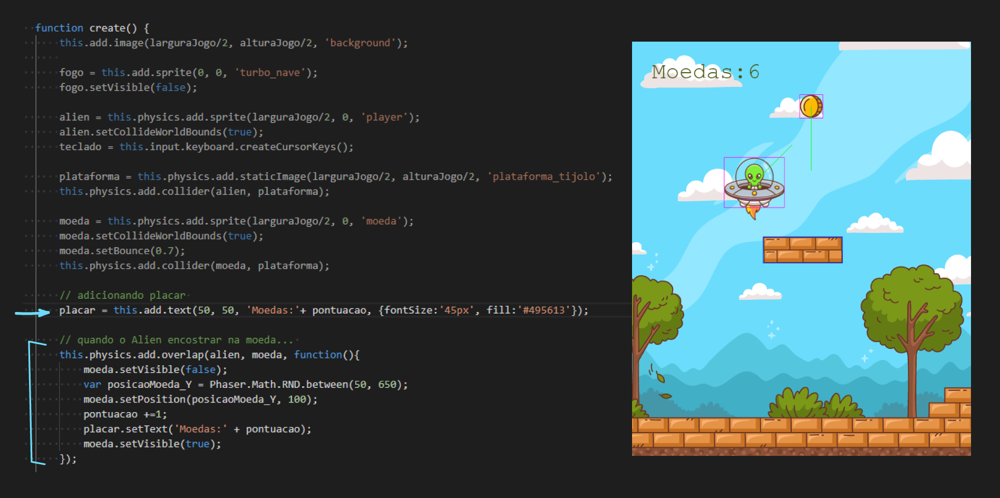  

<p>  
<br>  

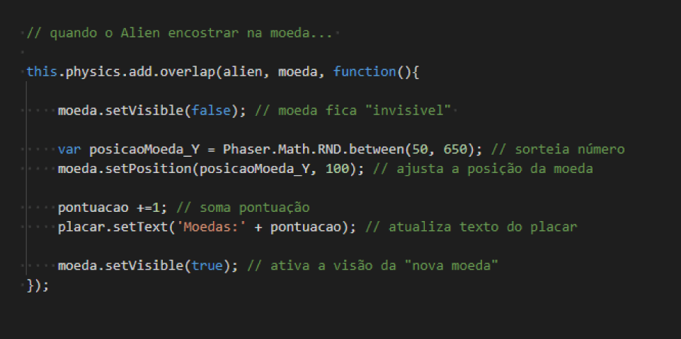  

<p>  

**Definiremos um ``overlap`` para quando o alienígena encostar na moeda**  

Usaremos **``this.physics.add.overlap(objeto1, objeto2, function(){ acontecimento })``** para indicar que quando os ``objetos 1`` e ``objeto 2`` estiverem sobrepostos (overlap), uma certa sequencia de acontecimentos deve ocorrer.  

Quando o overlap for detectado, indicamos que a moeda deve ficar invisível com ``moeda.setVisible(false)``. Depois, sorteamos com uma função randômica / aleatória ``Phaser.Math.RND.between(min,max)`` um novo valor para a posição y (horizontal) da moeda e aplicamos a nova posição na moeda.  

Com ``pontuacao +=1`` indicamos que deve ser somado +1 ao valor atual da pontuação. E com ``placar.setText`` atualizamos os valores guardados em ``placar``.  

Por último, reativamos a visibilidade da moeda (que já está em sua nova posição).  

Você deve conseguir ver em sua tela do jogo o plano de fundo, a plataforma estática, o placar, o alienígena (e conseguir controlá-lo com as setas do teclado) e a moeda. Você deve conseguir voar com o alienígena até a moeda e, ao encostar nela, o placar deve indicar +1 moeda coletada. Ao coletar uma moeda, uma nova moeda deve surgir na tela. 

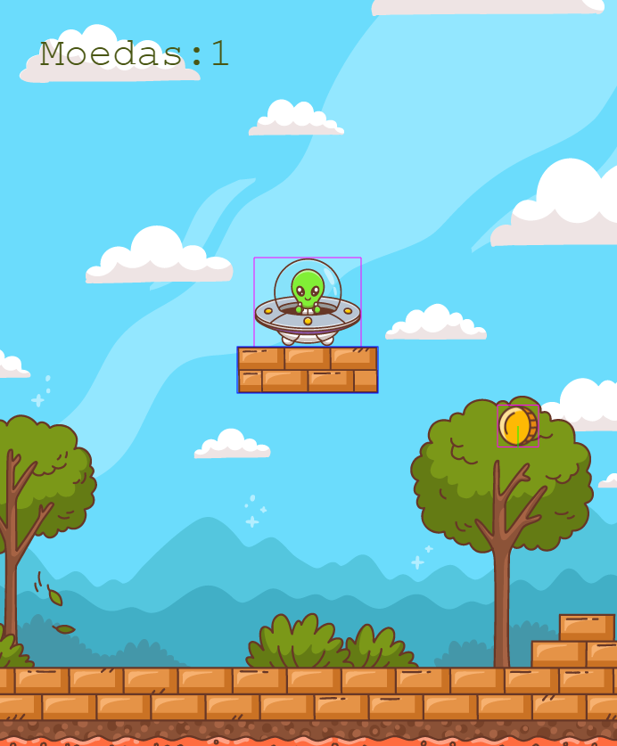  

<p>  
<br>  


### Tarefas Adicionais:  

**1. Organize e comente seu código!**  
Dedique um tempo para organizar espaçamentos e identações. Adicione comentários explicativos ao longo do código - aqui, quanto mais detalhado melhor! Isso garante que você tenha entendido todas as partes da estrutura. O que descobrir de dúvidas, deixe anotado em seu arquivo.  

**2. Inclua mais um obstáculo na tela**  
Assim como adicionamos uma plataforma, adicione um segundo obstáculo na tela (pode ser outra plataforma, um planeta, uma árvore ou outro objeto você queira). Seu alienígena e suas moedas devem colidir com esse novo obstáculo. Carregue a imagem, crie o obstáculo e crie as colisões necessárias.  

**3. Publique seus resultados no GitHub e envie sua resposta no card da Adalove**  
Publique o resultado do exercício em seu GitHub Individual, de maneira organizada. Envie o link do projeto no card da Adalove.

#### Sobre a avaliação  

- Realização do "Exercício do Alienígena", de acordo com as instruções do tutorial: até 3 pontos
- Código comentado, explicado e organizado: até 2 pontos
- Adição de mais um obstáculo (com colisão) na cena: até 3 pontos
- Publicação no GitHub, em conta individual e repositório apropriado: até 1 ponto
- Desafio! Utilize a estrutura de dados do tipo lista em seu código: até 1 ponto